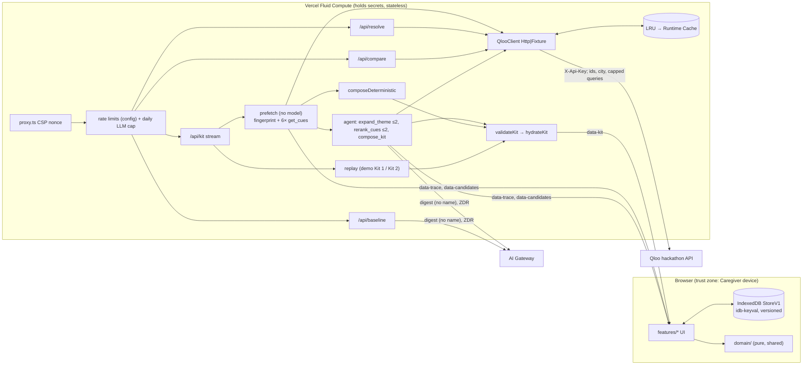

# Memory Lane: Build Plan (source of truth)

Status: **v3**, 2026-10-03. Deadline 2026-10-30 23:45 ET.

**Precedence.** PLAN.md is the build source of truth. `EVALS.md`, `UX.md` and `ASSUMPTIONS.md` point back here, and PLAN wins on any conflict.

**Inputs:** `REQUIREMENTS.md` (FR/NFR/SC), `EVALS.md`, `UX.md`, `CONTEXT.md` (terms used exactly), ADR 0001-0003, `docs/qloo-api.md`, `ASSUMPTIONS.md`, and the approved plan `~/.claude/plans/use-the-mattpodock-skills-quirky-raven.md`.

**Open items.** **[QLOO-GATED]** marks an item that only the Qloo key can settle. Each one has a default and a named check in slice K. Nothing else is open.

**Deviations from REQUIREMENTS** (**signed off by the user 2026-10-03 at check-in (a)**):
- **FR-9 (partial).** FR-9 asks for an agent tool loop that calls Qloo and composes. The work is split:
  - The **server prefetches** the baseline candidates (fingerprint plus 6 domains) with no model. This makes the run fast, deterministic, and the source for the fallback.
  - The **agent** then makes its own bounded Qloo calls: up to 2 `expand_theme` (deepening a fingerprint tag) and up to 2 `rerank_cues`. Then it composes.
  - The trace labels which is which: "Asking Qloo" is the server; "Arranging" is the agent.
- **FR-12.** A failing Prompt is replaced by a vetted template, not regenerated by the LLM. This keeps the guard deterministic and avoids an extra call.
- **SC-5.** The golden path is **≤ 7 clicks, met at click 6**. The improved Kit appears at click 6, and click 7 (Without Qloo) completes the judge story.

## 0. Live environment facts (probed 2026-10-03)

| Fact | How verified | Design consequence |
|---|---|---|
| The Gateway lists 407 models, including **`anthropic/claude-sonnet-5.5`** (dot form) and **`openai/gpt-5.6-sol`** | Live `GET ai-gateway.vercel.sh/v1/models` | `MODEL_ID=anthropic/claude-sonnet-5.5`. The brief's `-5-5` form would fail. Judge: `JUDGE_MODEL_ID=openai/gpt-5.6-sol`, a different model family |
| `vercel whoami` → `henrysebastien1982-6771`. `gh auth` → `SebAustin` with scopes `repo, workflow, gist, read:org` | Live CLI | Repo creation and workflow pushes are possible. Env and deploy rights are confirmed in slice 1 (`vercel link`, `vercel env ls`) |
| Direct dependencies: `ai` **7.0.127**, **`@ai-sdk/gateway` 4.0.103**, next 16.3.8, react 19.2.8, zod ^4. Dev: vitest 5, `@vitest/coverage-v8`, `@playwright/test` 1.63, `@types/node` ^24. **msw and @ai-sdk/react removed** | `package.json` + `node_modules` | Tests inject `fetch`. The client uses `readUIMessageStream`. Later slices add `lru-cache`, `idb-keyval`, `@vercel/functions`, `server-only`, `fake-indexeddb`, `@axe-core/playwright` and `tsx` |
| v7 API names: **`isStepCount`** (not `stepCountIs`), `hasToolCall`, `prepareStep` receiving `stepNumber` and returning `{toolChoice, activeTools}`, `repairToolCall`, `readUIMessageStream`, `createUIMessageStream`. `MockLanguageModelV4` lives in `ai/test` | Grep of `node_modules/ai/dist/*.d.ts` | §3.3 uses exactly these names |
| `providerOptions.gateway` supports `caching:'auto'`, `zeroDataRetention` and `disallowPromptTraining` | `@ai-sdk/gateway` d.ts | Every LLM call uses `LLM_PROVIDER_OPTIONS`. Slice 3a-ii confirms a ZDR route exists (R13) |
| Anthropic prompt-cache minimum is 1024 tokens. Hobby Fluid Compute caps functions at 300 s and allows 1 WAF rate-limit rule. Next 16 uses `proxy.ts` | Vendor docs | The static prompt is about 2.5k tokens. `maxDuration=120`. The CSP nonce is set in `src/proxy.ts` |
| Qloo key **not issued** | User | Fixture adapter until slice K |

## 1. Architecture



### Trust boundaries
- **Browser → server: untrusted.** Requests are Zod-validated, size-capped and rate-limited. The server recomputes the Reminiscence Window from `birthYear`.
- **Server → Qloo.** Only IDs, city strings and the capped text flows in §5.4. The key travels in a server-side header.
- **Server → Gateway.** Only the scrubbed LifeStoryDigest and compact Cue records. The model never controls Exclusions, the Window or locations.
- **Model → UI.** Model output is untrusted until `validateKit` and `hydrateKit` have run.

### Kit run: `POST /api/kit`
1. **Open.** Validate, rate-limit, open the stream. The first `data-trace` must be emitted within 2 s.
2. **Prefetch, no model.** `prefetch(ctx)` fetches the fingerprint and 6 × `get_cues` in parallel, then runs the ladder (§5.3). It emits `data-trace` and `data-candidates` per domain.
3. **Upstream failure.** If ≥ 2 domains fail, emit `notice:upstream_error`. The client then shows its last saved Kit or the first-run error. **Exception (demo):** the demo story streams its recording instead (Kit 1, or Kit 2 when generation ≥ 2).
4. **Compose.** With a model and budget available, the agent receives the compacted registry plus the fingerprint, and has `expand_theme`, `rerank_cues` and `compose_kit`. Otherwise, or on any failure, run `composeDeterministic(prefetch)`.
5. **Finish.** `validateKit` → `hydrateKit` → `data-kit`. The client saves the Kit, so Session Mode works offline.

### Demo replay
- **Seeding.** `/p/demo-margaret/kit` seeds the demo story if it is missing.
- **Replay (`mode:'replay'`).** Streams the recorded trace and candidates, compressed to ≤ 2.5 s. It then runs `validateKit` on the recorded draft using the **current** Exclusions and the recorded registry, and emits `source:'recorded'`. The replay banner reads "Replay of a real run recorded <date> · Build it live" (or "fixture run" before slice K).
- **Recorded Kit 2.** It is served after a live failure at generation ≥ 2. The `learned` provenance flags are set only for entities that are Learned Favorites in the **current** profile. Every other carried-over "Because…" claim is replaced by the label "recorded example" (R6).

## 2. Tech choices

| Area | Choice | Rejected (why) |
|---|---|---|
| Stack | Next 16 App Router, TS strict, Node runtime, `.nvmrc` 24 | Repo defaults (Python/LangGraph, Snowflake/dbt/BI): no warehouse or BI here, and the user approved TS on Vercel |
| Agent | AI SDK 7 `ToolLoopAgent` with 3 bounded tools, after a server prefetch | LangGraph.js (graph overhead for a 2-3 step loop); a model-driven prefetch (slow, and no fallback data if the model fails); no agent Qloo calls at all (the agentic story would be weaker) |
| Model | `anthropic/claude-sonnet-5.5`, temp 0.3, 6k output tokens. Judge `openai/gpt-5.6-sol`, temp 0 (§8.3) | Haiku (weaker Prompts); Opus (latency) |
| Stream | `createUIMessageStream` with non-transient typed data parts; `fetch` + `readUIMessageStream` on the client | `useChat` (chat semantics); forwarding the agent UI stream (leaks un-validated text) |
| Qloo | Direct HTTPS behind `QlooClient` (ADR 0002) | `qloo mcp` (stdio only) |
| Cache | `lru-cache` → Vercel Runtime Cache, stale-if-error | Next `use cache` (no stale-on-error); Upstash (paid) |
| Rate limit | Config-driven per-instance buckets + 1 WAF rule + daily cap + prepaid credits (auto top-up off) | Upstash ratelimit (paid). Buckets are approximate; WAF and credits bound the worst case |
| Store | `idb-keyval` with a versioned `StoreV1`; `memoryStorage` fallback | localStorage (sync, 5 MB); Dexie (size); server DB (ADR 0001) |
| Images | `` with width/height; host allow-list | Next image optimizer (Hobby quota) |
| Tests | vitest 5, injected `fetch`, `fake-indexeddb`, Playwright (chromium, webkit, firefox) + axe | MSW (removed; one seam is enough) |

## 3. Module map (deep modules, small interfaces)

- `domain/` is pure: time is injected, values are immutable, and it runs on client and server.
- `qloo/`, `agent/` and `server/` import `server-only`.
- `app/api/*/route.ts` files are thin shells over handler factories `(req, deps) => Response`.

### 3.1 `src/qloo/` (one seam: `QlooClient`)
```ts
export type Domain = 'music'|'film'|'tv'|'book'|'place'|'brand';
export type EnvelopeStatus = 'ok'|'empty'|'needs_input'|'partial'|'degraded'|'error';
export type ErrorCode = 'rate_limited'|'auth'|'unsupported_type'|'bad_param'|'schema'|'timeout'|'upstream'|'budget'|'unknown_id';
export interface QlooProvenance { endpoint: string; paramsKey: string; cached: boolean; stale: boolean; retries: number; ms: number; synthetic?: boolean }
export interface Envelope<T> { status: EnvelopeStatus; data: T | null; provenance: QlooProvenance; hint?: string; errorCode?: ErrorCode }
export interface QlooClient {
  search(q: { query: string; types: EntityUrn[]; take?: number }, o?: CallOpts): Promise<Envelope<QlooEntity[]>>;
  insights(p: InsightsParams, o?: CallOpts): Promise<Envelope<{ entities?: QlooEntity[]; tags?: QlooTag[] }>>;
  tags(q: { query: string; tagTypes?: string[]; take?: number }, o?: CallOpts): Promise<Envelope<QlooTag[]>>;
  compare(p: { a: string[]; b: string[]; filterType: EntityUrn; take?: number }, o?: CallOpts): Promise<Envelope<QlooCompare>>;
}
export interface CallOpts { signal?: AbortSignal; budget?: CallBudget }   // budget.take() false → error 'budget', no HTTP call
export function createQlooClient(cfg: ServerConfig, deps?: Partial<{ fetch: typeof fetch; cache: KvCache; sleep: (ms: number) => Promise<void>; random: () => number }>): QlooClient;
export function createCallBudget(max: number, reserve: { agent: number }): CallBudget;  // take(kind: 'prefetch'|'agent'): boolean
export function buildInsightsParams(req: CueRequest, bound: BoundContext): InsightsParams;   // §5.1
export function cacheKey(endpoint: string, params: object): string;                          // sha256(endpoint + sorted canonical query)
export function backoffDelay(attempt: number, p: RetryPolicy, rnd: () => number, retryAfterSec?: number): number;
export function createTieredCache(o: { lruMax: number; runtime?: RuntimeCacheLike }): KvCache;
export function normalizeEntity(raw: unknown, imageHosts: string[]): QlooEntity | null;     // image string|{url}; off-list host → null
export function resolveSeed(c: QlooClient, q: { query: string; domain: Domain }): Promise<Envelope<SeedCandidate[]>>;
export function resolveTag(c: QlooClient, q: { query: string }): Promise<Envelope<TagCandidate[]>>;
```
**`HttpQlooClient({baseUrl, apiKey, fetch, cache, retry, sleep, random})` invariants:**
- It never throws.
- Cache keys never contain the first name.
- Retries happen only on 429, 5xx or timeout, at most 3 times. `signal` aborts both the wait and the fetch.
- `needs_input` is returned unless the top match has similarity ≥ 0.92 and the runner-up < 0.80.

**`FixtureQlooClient({index, strict, faults})` behaves like Qloo for any Taste Profile (R3):**
- **Insights lookup.** Matches on `(endpoint, filter.type, window min/max, location query)` and **ignores interests and excludes**, so regeneration after any Reactions still hits fixtures.
- **Exclusions.** Applies `filter.exclude.entities` and `filter.exclude.tags` itself.
- **Tag-signal requests** (`expand_theme`) return the domain set filtered to entities carrying one of those tags. If nothing matches, they return the unfiltered domain set.
- **Re-rank.** `filter.results.entities` returns those IDs from any loaded fixture, re-scored.
- **Explainability.** Computed **deterministically** for every requested Seed and Learned Favorite ID, using an FNV-1a hash mapped to 0.30-0.90. It is marked `provenance.synthetic:true`, so the UI shows "fixture data".
- **Unknown `/search`** returns `empty` with the hint "Fixture mode: try the demo Seeds (P1-P5)".
- **Strict mode** throws only on an unknown `(endpoint, type, window, location)` combination.
- **`faults`** comes from `QLOO_FIXTURE_FAULTS` and is honoured only when `VERCEL_ENV` is unset.

### 3.2 `src/domain/` (pure; ≥ 80% coverage, `validator.ts` ≥ 90%)
```ts
export function reminiscenceWindow(birthYear: number): ReminiscenceWindow;     // ORIGINAL: {start: by+10, end: by+30, label}
export function effectiveWindow(w: ReminiscenceWindow, widened: boolean): ReminiscenceWindow; // ±3 only via the Caregiver CTA (R2)
export const AGE_BUCKET = '55_and_older' as const;
export function toDigest(story: LifeStory): LifeStoryDigest;   // drops firstName; replaces it (word-boundary, case-insensitive) with "{name}" in all free text
export function scrubQuery(text: string, firstName: string): string;
export function detectPiiRisk(text: string): PiiFinding[];
export function profileFromStory(story: LifeStory): TasteProfile;
export function toSignals(p: TasteProfile, sensitiveOptIn: boolean): ProfileSignals; // interests ≤ 10 by weight; exclusions + SENSITIVE_TAG_IDS unless opt-in
export function applyReactions(p: TasteProfile, entry: SessionLogEntry, kit: Kit, now: string): TasteProfile;
export function revertReaction(p: TasteProfile, r: Reaction): TasteProfile;
export function diffKits(prev: Kit, next: Kit, before: TasteProfile, after: TasteProfile): KitDiff;
export const SESSION_FORMATS: Readonly<Record<DementiaStage, SessionFormatRule>>;
export function checkText(text: string, scope: 'heading' | 'body', ctx: TextCheckContext): TextIssue[];
export function validateKit(draft: KitDraft, ctx: ValidationContext): { kit: KitDraft; drops: Drop[]; repairs: Repair[] };
export function compareKits(q: Kit, b: BaselineKit, res: BaselineResolution[], original: ReminiscenceWindow, ex: ProfileSignals): ComparisonReport;
export function nameSimilarity(a: string, b: string): number;
```

**`SESSION_FORMATS` (FR-6):**

| Stage | Format | Cues | Prompts per Cue | Words per Prompt | `sensoryActivities` |
|---|---|---|---|---|---|
| early | `conversation` | 4-6 | ≤ 3 | ≤ 25 | ≥ 1 |
| middle | `mixed` | 4-6 | ≤ 2 | ≤ 18 | ≥ 1 |
| late | `sensory` | 3-5 | ≤ 1 | ≤ 12 | ≥ 2 |

**Reaction rules:**
- **Engaged:** becomes a Learned Favorite, or adds weight (max 3).
- **Distressed:** adds the entity and its top-2 tags as Exclusions, and removes a matching Learned Favorite. Distressed beats Engaged.
- **Neutral:** no change.
- Exclusions only grow, except through undo.

**`checkText` scopes (R4):**
- **`body`** covers prompts, caregiverTips, sensoryActivities and whyThis. Checks:
  - quiz regex
  - claim lexicon
  - Avoid List terms (including song titles)
  - sensitive-theme lexicon (unless the Caregiver opted in)
  - quoted strings
  - **invented names**: Title-Case runs of 2+ words that are not on the allow-list
- **`heading`** covers title and theme. Checks quoted strings, Avoid terms, the sensitive lexicon and the claim lexicon (no therapeutic-outcome words such as "therapy", "heal", "improve memory") **only**. The Title-Case rule never applies to headings.
- **Allow-list:**
  - registry names, Seed names, **Learned Favorite names**, **fingerprint tag names**
  - Hometown, Young-Adult City, Care Location
  - **days, months, holidays**
  - sentence-initial words
- **OK fixtures include the UX example titles:** "Saturday Night at the Pictures, 1962", "Mama's Kitchen", "Sunday Best at the Grand Ole Opry".

**`validateKit` pipeline** (fixed order; idempotent, so a second pass makes 0 drops and 0 repairs):
1. **Grounding.** Drop IDs that are not in the registry.
2. **Exclusions.** Drop excluded entities and tags.
3. **Window (R2).**
   - Film, TV and book Cues with no year, or outside the **effective** Window, are dropped.
   - Cues inside the effective Window but outside the **original** one are kept, with `outsideWindow:true` whatever the cause.
   - Era fit is always measured against the original Window. If slice K shows book years missing, books become "era reported, not gated".
4. **Duplicates.** Drop repeats.
5. **Text.** Run `checkText` on every model string with its scope. A failing string is replaced from `src/agent/templates.ts` (keyed by domain × stage). This is the FR-12 deviation.
6. **Stage fit.**
   - Set the format.
   - Trim Prompts to the cap.
   - Replace over-long Prompts.
   - Top up `sensoryActivities` from templates.
   - Clamp `durationMin`.
7. **Novelty.** If < 30% of Cues are new versus `previousCueIds`, swap the lowest-affinity repeats for unused new Cues from the same domain (re-checked against steps 2-4).
8. **Backfill.** Refill each Session to the stage's minimum Cue count from top-affinity unused Cues (re-checked against steps 2-4).

### 3.3 `src/agent/`
```ts
export interface BoundContext { window: ReminiscenceWindow; widened: ReadonlyArray<'film'|'tv'|'book'>; ageBucket: typeof AGE_BUCKET;
  hometown: string; careLocation?: string; signals: ProfileSignals; stage: DementiaStage; previousCueIds: string[] }
export interface Prefetch { registry: RunRegistry; byDomain: Record<Domain, { status: EnvelopeStatus; ids: string[] }>; fingerprint: QlooTag[]; budget: CallBudget }
export function prefetch(ctx: { client: QlooClient; bound: BoundContext; emit: StreamEmitter; signal: AbortSignal }): Promise<Prefetch>;
export function createKitTools(ctx: { client: QlooClient; pre: Prefetch; bound: BoundContext; emit: StreamEmitter; signal: AbortSignal }):
  { expand_theme: Tool; rerank_cues: Tool; compose_kit: Tool };
export function compactRegistry(pre: Prefetch, bound: BoundContext): string; // ≤ 15 Cues per domain; previously shown non-LF Cues get affinity × 0.5
export const SYSTEM_PROMPT: string;                                           // static, ≥ 1024 tokens, canary "ML-CANARY-7f3a"
export const LLM_PROVIDER_OPTIONS: { gateway: { caching: 'auto'; zeroDataRetention: true; disallowPromptTraining: true } };
export function composeKit(req: KitRequest, deps: { client: QlooClient; model: LanguageModel | null; emit: StreamEmitter; signal: AbortSignal; now: () => number }): Promise<ComposeOutcome>;
export function composeDeterministic(pre: Prefetch, bound: BoundContext): KitDraft;   // uses templates.ts
export function composeBaseline(d: LifeStoryDigest, model: LanguageModel, signal: AbortSignal): Promise<BaselineKit>;
export function hydrateKit(d: KitDraft, reg: RunRegistrySnapshot, bound: BoundContext, profile: TasteProfile, meta: KitMeta): Kit;
export function replayRecorded(rec: Recording, profile: TasteProfile, emit: StreamEmitter): Promise<Kit>; // ≤ 2.5 s; current Exclusions; R6 learned flags
export function getModel(cfg: ServerConfig): LanguageModel | null;           // 'gateway' | 'mock' (refused if VERCEL_ENV set) | 'off'
```

**Agent tools.** All are read-only and return envelopes. None of them throws.

| Tool | Input | Qloo call | Limits |
|---|---|---|---|
| `expand_theme` (R1) | `{domain, tagIds: Id[] ≤3, take: 5..10, forSession?: 1..4}`; every `tagId` must be in `pre.fingerprint`, else `unknown_id` | `/v2/insights`: `filter.type` = the domain's type, `signal.interests.tags` = tagIds, plus server-bound Window, location, age and Exclusions | ≤ 2 calls per run, from the agent budget. New entities join the registry and stream as `data-candidates`. Trace: "Looking deeper into 'country & western' for Session 2" (tag name from Qloo; session number is an integer) |
| `rerank_cues` | `{domain, entityIds ≤20}`; every ID must be in the registry | `filter.results.entities` | ≤ 2 calls, from the agent budget |
| `compose_kit` | `KitDraft` | none | Terminal |

**Loop (R9):**
- **Setup.** `new ToolLoopAgent({ model, instructions: SYSTEM_PROMPT, tools, temperature: 0.3, maxOutputTokens: 6000, providerOptions: LLM_PROVIDER_OPTIONS })`, then `agent.generate({ prompt: renderDigest(d) + compactRegistry(pre), abortSignal })`.
- **Stop conditions:** `stopWhen: [composeAccepted, composeFailedTwice, isStepCount(5)]`.
  - `composeAccepted`: the last step has a successful `compose_kit` result.
  - `composeFailedTwice`: 2 `compose_kit` tool-errors across steps.
- **Forcing compose.** When **`stepNumber ≥ 2` (zero-based)**, `prepareStep` returns `{ activeTools: ['compose_kit'], toolChoice: { type: 'tool', toolName: 'compose_kit' } }`.
- **Expected shape.** Step 0 makes 0-2 `expand_theme` calls plus an optional rerank. Step 1 composes. Steps 2-4 are only for repair.
- **Abort.** `AbortSignal.any([request.signal, AbortSignal.timeout(90_000)])`.
- **Fallback to `composeDeterministic(pre)`** on any of: no accepted compose, two compose errors, abort, or a Gateway error after 1 retry.

### 3.4 `src/server/` and routes
```ts
export interface ServerConfig { qlooMode: 'fixture'|'live'; llmMode: 'gateway'|'mock'|'off'; modelId: string; judgeModelId: string;
  rateLimitMode: 'on'|'off'; limits: Record<'resolve'|'kitLive'|'kitReplay'|'baselineLive'|'baselineReplay'|'compare', { capacity: number; perMinutes: number }>;
  llmDailyCap: number; imageHosts: string[] }
export function getServerConfig(env?: NodeJS.ProcessEnv): ServerConfig;   // throws if RATE_LIMIT_MODE=off while VERCEL_ENV is set (R5); live mode without a key → boot error
export function createRateLimiter(o: { capacity: number; perMinutes: number }): (key: string) => { ok: boolean; retryAfterSec: number };
export function clientKey(req: Request): string;                          // sha256(daily salt + first x-forwarded-for)
export function consumeDailyLlmRun(cache: KvCache, cap: number, day: string): Promise<boolean>;
export function parseJson<T>(req: Request, s: ZodType<T>, maxBytes: number): Promise<T | Response>;
export function logEvent(e: LogEvent): void;
```

| Route | Body | Response | Bucket (default per IP) |
|---|---|---|---|
| `POST /api/resolve` | `{kind:'entity'\|'tag', query≤80, domain?}` | `Envelope<Candidate[]>` | `resolve` 60 / 1 min |
| `POST /api/kit` | `KitRequest` ≤ 16 KB | UI message stream, `maxDuration=120` | live: `kitLive` 6 / 10 min + daily cap 150. Replay: `kitReplay` 30 / 10 min, **exempt from the cap** |
| `POST /api/baseline` | `BaselineRequest {storyId, digest, mode}` (R7) | `BaselineKit` | live: `baselineLive` 6 / 10 min + cap. Replay: `baselineReplay` 30 / 10 min |
| `POST /api/compare` | `{kitEntityIds≤32, baselineItems≤24 (name≤120, year?, domain), birthYear, exclusions}` | `ComparisonReport` (≤ 24 `/search`, concurrency 4) | `compare` 10 / 10 min |
| `POST /api/visitor-compare` (C) | `{personSeedIds≤5, visitorSeedIds≤5}` | `Envelope<Cue[]>` | `compare` |

- **Replay is demo-only.** `mode:'replay'` with a non-demo `storyId` returns **400** on both `/api/kit` and `/api/baseline`.
- **Bucket full** → 429 with `Retry-After`.
- **Daily cap reached** → a deterministic or recorded Kit plus `notice:cap_reached`.

### 3.5 Client store `src/lib/store/`
```ts
export interface KeyValueStorage { get(k: string): Promise<unknown>; set(k: string, v: unknown): Promise<void>; del(k: string): Promise<void> }
export interface Repository { getState(): StoreV1; subscribe(fn: () => void): () => void;
  saveDraft(d: LifeStoryDraft | null): Promise<void>; saveLifeStory(s: LifeStory): Promise<void>; deleteLifeStory(id: StoryId): Promise<void>;
  saveKit(k: Kit): Promise<void>; appendSessionLog(e: SessionLogEntry): Promise<void>; setProfile(id: StoryId, p: TasteProfile): Promise<void>;
  exportAll(): ExportFile; importAll(raw: string): Promise<ImportResult>; deleteAll(): Promise<void> }
export function createRepository(storage: KeyValueStorage, migrations: Migration[]): Repository;
export function useStore<T>(select: (s: StoreV1) => T): T;
```
**Invariants:**
- Writes produce new objects.
- `migrate()` runs on load. Future versions open read-only, and invalid data goes to quarantine.
- Import is capped at 512 KB, strict, and requires confirmation.
- `exportAll → deleteAll → importAll` is deep-equal.
- No cookies.

### 3.6 Routes and UI features
| Route | Features (`src/features/*`) |
|---|---|
| `/` | Landing. **Meet Margaret** links to `/p/demo-margaret/kit`. **Start a Life Story** |
| `/intake?step=1..6` | `intake/`: 6-step wizard with the draft saved after every step, Seed chips, Avoid List, PII hints, `sensitiveThemesOptIn` on step 5 |
| `/p/[storyId]/kit` | `kit/` (`KitView`, `CueCard[data-entity-id]`, `PhotoPile`, `LearnedDiffPanel`, Widen-by-3-years CTA per empty film/TV/book domain, `useKitStream`), `trace/`, `provenance/`. Print uses `@media print` |
| `/p/[storyId]/session/[n]` | `session-mode/`: player, live Reaction radiogroup, **bottom bar holding Back, Skip, Reactions, Next and End** on every layout, Pause, and the wrap-up state at `?cue=done` |
| `/p/[storyId]/compare` | `compare/`; Visitor tab (C) |
| `/about` | How it works, evidence, and `#privacy` = Your data (export, import, delete all, story switcher) |

### 3.7 Test seams
1. `QlooClient`
2. injected `fetch`
3. `sleep` / `random`
4. `KvCache`
5. `LanguageModel` (`MockLanguageModelV4` scripted + recording spy)
6. `StreamEmitter`
7. `KeyValueStorage`
8. handler factories
9. `getServerConfig(env)`
10. clock
11. `consumeKitStream(body, onSnapshot)`

## 4. Data contracts (`src/contracts/*.ts`, Zod 4)

### 4.1 Schemas
```ts
const Id = z.string().min(1).max(64); const Place = z.string().trim().min(2).max(80);
const Domain = z.enum(['music','film','tv','book','place','brand']); const Stage = z.enum(['early','middle','late']);
export const StoryId = z.union([z.uuid(), z.literal('demo-margaret')]);
export const Seed = z.object({ entityId: Id, name: z.string().max(120), domain: Domain, year: z.number().int().optional(), imageUrl: z.url().nullable() });
export const AvoidItem = z.discriminatedUnion('kind', [
  z.object({ kind: z.literal('entity'), entityId: Id, name: z.string().max(120), domain: Domain }),
  z.object({ kind: z.literal('tag'), tagId: Id, name: z.string().max(80) }),
  z.object({ kind: z.literal('topic'), text: z.string().trim().min(2).max(60) }) ]);
export const SeedRef = z.object({ entityId: Id, name: z.string().max(120) });   // Seeds and Learned Favorites travel as {entityId, name} pairs, never as parallel arrays
export const FirstName = z.string().transform(s => s.normalize('NFC').trim().replace(/[\u2019\u02BC]/g, "'"))   // NFC; typographic apostrophes map to '
  .pipe(z.string().min(1).max(30).regex(/^[\p{L}\p{M}'-]+(?: [\p{L}\p{M}'-]+)*$/u).regex(/\p{L}/u));   // letters, marks, ' and -, single inner spaces
export const LifeStory = z.object({ id: StoryId, firstName: FirstName,
  birthYear: z.number().int().min(1920).max(1975), hometown: Place, youngAdultCity: Place.optional(), careLocation: Place.optional(),
  heritage: z.string().max(60).optional(), language: z.string().max(40).optional(), occupation: z.string().max(60).optional(),
  seeds: z.array(Seed).min(2).max(5), avoidList: z.array(AvoidItem).max(10), dementiaStage: Stage,
  sensitiveThemesOptIn: z.boolean().default(false), createdAt: z.iso.datetime() });
export const LifeStoryDraft = z.object({ step: z.number().int().min(1).max(6), values: LifeStory.partial(), updatedAt: z.iso.datetime() });
export const LifeStoryDigest = LifeStory.omit({ id: true, firstName: true, createdAt: true, seeds: true, avoidList: true })
  .extend({ seeds: z.array(SeedRef).min(2).max(5), avoidTopics: z.array(z.string().max(60)).max(10) }).strict();
export const TasteProfile = z.object({ version: z.number().int().min(0), seeds: z.array(SeedRef).min(2).max(5),
  learnedFavorites: z.array(z.object({ entityId: Id, name: z.string().max(120), domain: Domain, weight: z.number().int().min(1).max(3), fromSessionId: Id })).max(20),
  exclusions: z.array(z.object({ kind: z.enum(['entity','tag']), id: Id, label: z.string().max(120), source: z.enum(['avoid','reaction']), addedAt: z.iso.datetime() })).max(100),
  avoidTopics: z.array(z.string().max(60)).max(10) });
export const Provenance = z.object({ affinity: z.number().min(0).max(1),
  seeds: z.array(z.object({ entityId: Id, name: z.string(), score: z.number(), learned: z.boolean() })),
  signals: z.object({ ageBucket: z.literal('55_and_older'), hometown: z.string().optional(), careLocation: z.string().optional(),
    window: z.object({ start: z.number(), end: z.number() }).optional(), themeTag: z.string().optional() }),   // themeTag: set when found by expand_theme
  signalsOnly: z.boolean(), cached: z.boolean(), synthetic: z.boolean(), recordedExample: z.boolean(), envelope: z.enum(['ok','partial','degraded']) });
export const Cue = z.object({ entityId: Id, domain: Domain, name: z.string(), year: z.number().int().optional(), imageUrl: z.url().nullable(),
  tags: z.array(z.object({ id: Id, name: z.string() })).max(3), outsideWindow: z.boolean(), whyThis: z.string().max(160),
  prompts: z.array(z.string().max(140)).min(1).max(3), provenance: Provenance });
const SessionCore = { title: z.string().max(60), theme: z.string().max(120), format: z.enum(['conversation','mixed','sensory']),
  durationMin: z.number().int().min(20).max(45), sensoryActivities: z.array(z.string().max(200)).min(1).max(3),
  caregiverTips: z.array(z.string().max(160)).min(1).max(3) };
export const KitDraft = z.object({ sessions: z.array(z.object({ ...SessionCore,
  cues: z.array(z.object({ entity_id: Id, domain: Domain, whyThis: z.string().max(160), prompts: z.array(z.string().max(140)).min(1).max(3) })).min(3).max(8) })).min(3).max(4) });
export const BaselineKit = z.object({ sessions: z.array(z.object({ ...SessionCore,
  cues: z.array(z.object({ name: z.string().max(120), year: z.number().int().optional(), domain: Domain, whyThis: z.string().max(160),
    prompts: z.array(z.string().max(140)).min(1).max(3) })).min(3).max(8) })).min(3).max(4) });
export const Session = z.object({ id: Id, ...SessionCore, cues: z.array(Cue).min(3).max(8) });
export const Notice = z.object({ level: z.enum(['info','warn','error']), code: z.enum(['recorded','cached','partial','deterministic','cap_reached',
  'rate_limited','omitted_domain','validator_drops','budget','upstream_error','aborted','fixture']), message: z.string().max(160), domain: Domain.optional() });
export const Kit = z.object({ id: z.uuid(), storyId: StoryId, generation: z.number().int().min(1), createdAt: z.iso.datetime(),
  source: z.enum(['agent','deterministic','recorded']), window: z.object({ start: z.number(), end: z.number() }),   // ORIGINAL window
  widened: z.array(z.enum(['film','tv','book'])), sessions: z.array(Session).min(3).max(4),
  fingerprint: z.array(z.object({ id: Id, name: z.string(), affinity: z.number() })).max(20),
  notices: z.array(Notice), qloo: z.object({ calls: z.number(), cacheHits: z.number(), agentCalls: z.number() }), omittedDomains: z.array(Domain) });
export const Reaction = z.object({ cueEntityId: Id, sessionId: Id, value: z.enum(['engaged','neutral','distressed']), at: z.iso.datetime() });
export const SessionLogEntry = z.object({ id: z.uuid(), kitId: z.uuid(), sessionId: Id, startedAt: z.iso.datetime(), endedAt: z.iso.datetime().optional(), reactions: z.array(Reaction).max(16) });
export const TraceEvent = z.object({ id: z.string(), atMs: z.number().int(), phase: z.enum(['understanding','asking','arranging','checking']),
  actor: z.enum(['server','agent','validator']), status: z.enum(['start','ok','empty','partial','degraded','error']), label: z.string().max(140),
  domain: Domain.optional(), counts: z.object({ cues: z.number().optional(), qlooCalls: z.number(), cacheHits: z.number(), dropped: z.number().optional() }).optional() });
export const CandidateBatch = z.object({ domain: Domain, source: z.enum(['prefetch','expand_theme']),
  items: z.array(z.object({ entityId: Id, name: z.string(), imageUrl: z.url().nullable(), domain: Domain })).max(15) });
export const KitRequest = z.object({ storyId: StoryId, digest: LifeStoryDigest, profile: TasteProfile, generation: z.number().int().min(1),
  mode: z.enum(['replay','live']).default('live'), widen: z.array(z.enum(['film','tv','book'])).max(3).default([]),
  previousCueIds: z.array(Id).max(32).default([]) }).strict();
export const BaselineRequest = z.object({ storyId: StoryId, digest: LifeStoryDigest, mode: z.enum(['replay','live']).default('live') }).strict();
export const StoreV1 = z.object({ schemaVersion: z.literal(1), lifeStories: z.array(LifeStory).max(10), draft: LifeStoryDraft.nullable(),
  profiles: z.record(z.string(), TasteProfile), kits: z.record(z.string(), z.array(Kit).max(6)),
  sessionLogs: z.record(z.string(), z.array(SessionLogEntry).max(50)), activeStoryId: StoryId.nullable() });
export const ExportFile = z.object({ app: z.literal('memory-lane'), schemaVersion: z.number().int(), exportedAt: z.iso.datetime(), data: StoreV1 });
```
Generated text uses the placeholder `{name}`, which is filled in client-side only at render time.

### 4.2 Stream protocol (`/api/kit`)
`UIMessage<never, { trace: TraceEvent; candidates: CandidateBatch; kit: Kit; notice: Notice }>`. All parts are **non-transient**.

Order:
1. `data-notice` (recorded, cap, fixture or degraded).
2. `data-trace`, with stable IDs so a line updates in place. `actor` separates server, agent and validator lines.
3. `data-candidates`: prefetch batches, then any `expand_theme` batches. These carry registry data only.
4. Exactly one `data-kit`.
5. On failure: a `data-notice{level:'error'}` and no Kit.

`consumeKitStream` folds the parts into `{traces, candidates, kit, notices, status}`, and `useKitStream` adds abort. Trace labels come only from the typed builders in `trace.ts`.

## 5. Qloo integration

### 5.1 Per-domain params
Every call sends:
- `filter.exclude.entities`
- `filter.exclude.tags` (including `SENSITIVE_TAG_IDS` unless the Caregiver opted in)
- `feature.explainability=true`
- `take=15` (places: 10)

| Domain | `filter.type` | Signals | Filters |
|---|---|---|---|
| music | `urn:entity:artist` | interests = Seeds + Learned Favorites; `signal.demographics.age=55_and_older`; `signal.location.query`=Hometown | — |
| film / tv | `urn:entity:movie` / `urn:entity:tv_show` | interests, age | `filter.release_year.min/max` = effective Window (original, ±3 only if the Caregiver widened) |
| book | `urn:entity:book` | interests, age | release_year **[QLOO-GATED]**: if it is ignored, drop it; era is reported, not gated |
| place | `urn:entity:place` | `signal.interests.tags` = confirmed cuisine tags | `filter.location.query` = Care Location, else Hometown; `filter.price_level.max=3` |
| brand | `urn:entity:brand` | interests, age | — |
| fingerprint | `urn:tag` | interests | `take=20` |
| expand_theme | the domain's type | `signal.interests.tags` = fingerprint tagIds (≤ 3), age; music adds Hometown | the domain's window, location and exclusions; `take ≤ 10` |
| rerank | the domain's type | the domain's params | `filter.results.entities` |
| compare (C) | `/v2/analysis/compare` | `a.`/`b.signal.interests.entities` | `filter.type=urn:entity:artist`, `take=10` |

**Gated details:**
- **[QLOO-GATED] Per-entity weights.** If Qloo honours them, Seeds go in as `high` and Learned Favorites as 3/2/1 → high/medium/low. Otherwise ordering plus the 10-ID cap.
- **[QLOO-GATED] `SENSITIVE_TAG_IDS`** (war, bereavement, hospital/illness) are resolved in slice K and saved in `src/qloo/sensitiveTags.ts`. Until then they are `fx-` placeholders, and the `checkText` lexicon is the active guard.

### 5.2 Cache and retry
- **Key:** `sha256(endpoint + canonical params)`, with no name in it.
- **Freshness:** insights and compare stay fresh for 24 h; search and tags for 7 d. Stale entries can be served on error for up to 7 d, marked `degraded` with a "Cached result" badge.
- **Layers:** LRU (500) in front of Runtime Cache (namespace `qloo`, tag `qloo-v1`). In-flight requests are de-duplicated.
- **Backoff:** full jitter `min(2000, 250·2^n)·rand`; `Retry-After` honoured up to 2 s; 8 s timeout per attempt; 3 retries.

### 5.3 Call budget (16 per run)
1. **P1, parallel:** music, film, tv, book.
2. **P2, parallel:** place, brand, fingerprint.
3. **P3, the relaxation ladder.** Only for `empty` domains, at most 2 extra calls each, from a 5-call pool: drop tags, then use the top-2 Seeds only. **The ladder never widens the Window (R2).** If the domain is still empty, it is omitted. For film, TV and books the UI then offers **"Widen by 3 years"**, which resends with `widen`. Exclusions are never relaxed.
4. **P4, agent reserve of 4:** `expand_theme` ≤ 2 and `rerank_cues` ≤ 2. Prefetch can never use the reserve.

When the budget is exhausted, the call returns `error:'budget'` with no HTTP request, the trace notes it, and the domain or theme is skipped. Concurrency is capped at 6. **[QLOO-GATED]** The real quota is learned in slice K.

### 5.4 Text that reaches Qloo
All of it is `scrubQuery`'d and capped:

| Flow | Endpoint | Cap |
|---|---|---|
| Seed and Avoid List entity queries | `/search` | 80 chars |
| Avoid topic → tag; heritage → cuisine | `/v2/tags` semantic | 60 |
| Hometown, Care Location | location params | 80 |
| Baseline names | `/search` via `/api/compare` | ≤ 24 × 120 |

### 5.5 Fixtures and scripts
- **Fixtures.** `fixtures/qloo/index.json` is keyed as in §3.1 (R3). The hand-made fixtures (`fx-`, about 40) cover P1-P5 × 6 domains × {original, widened} windows, plus fingerprints.
- **`pnpm qloo:record`:**
  1. Records live responses.
  2. Scrubs them.
  3. Collects `QLOO_IMAGE_HOSTS`.
  4. Resolves `SENSITIVE_TAG_IDS`.
  5. Deletes the hand-made fixtures.
- **`pnpm qloo:smoke`.** Runs one `/search` plus one insights call per type (movie, tv_show, book, artist, place, brand, tag). It asserts 200, non-empty results, and that each filter takes effect. It exits non-zero on a silently ignored param.
- **`pnpm demo:record`.** Records Margaret's Kit 1, Kit 2 and the Baseline (draft, registry, trace, candidates).

## 6. Error, empty and degraded paths

| Condition | Behaviour | Caregiver sees |
|---|---|---|
| Seed ambiguous / not found | `needs_input` chips / `empty` | "Which Doris Day did you mean?" / "Check the spelling" |
| Domain empty after the ladder | Omitted | "No books turned up for 1956 to 1976. [Widen by 3 years] [Add a Seed]". Widened Cues are stamped "Just outside 1956-1976" |
| 1 domain errors | `partial` | Badge and gap card |
| ≥ 2 domains error, saved Kit exists | `notice:upstream_error` | Last Kit with a "Cached result" badge |
| ≥ 2 domains error, **first run** | Same notice, no Kit | "We couldn't build the Kit this time. Nothing was lost. [Try again] [Meet Margaret]" |
| Demo with ≥ 2 domains erroring, generation 1 / ≥ 2 | Replay of Kit 1 / Kit 2, validated against current Exclusions (R6) | Replay banner; a Kit 2 Cue not backed by a current Learned Favorite reads "recorded example" |
| 429 then stale cache | `degraded` | "Cached result. Qloo is busy." |
| No model / Gateway error / cap / 90 s / 2 compose errors / no compose | `composeDeterministic` | "Simple Kit (AI composer unavailable)". All Cues still come from Qloo |
| `expand_theme` errors or hits the budget | Skipped; the compose continues | Trace line "Couldn't look deeper this time" |
| Validator drops or repairs | Kit kept | "Checked: 21 of 21 from Qloo. Replaced 2 Prompts." |
| Bucket full | 429 + `Retry-After` | Wait message with a countdown |
| Store corrupt, future version or no IndexedDB | Quarantine / read-only / memory | Banner with Export |
| Offline in Session Mode | Local Kit | "Working offline" |
| Distressed | Exclusion + undo | Calm banner |

## 7. Security and privacy
- **Environment** (`src/config/env.ts`, server-only, Zod):
  - Variables: `QLOO_MODE`, `QLOO_API_KEY`, `QLOO_BASE_URL`, `LLM_MODE`, `MODEL_ID`, `JUDGE_MODEL_ID`, `AI_GATEWAY_API_KEY` (local/CI; OIDC on Vercel), `LLM_DAILY_RUN_CAP=150`, `RATE_LIMIT_MODE=on`, optional `RL_<BUCKET>` overrides, `QLOO_IMAGE_HOSTS`.
  - No `NEXT_PUBLIC_` variables.
  - `ALLOW_MOCK_LLM`, `QLOO_FIXTURE_FAULTS` and `RATE_LIMIT_MODE=off` are honoured **only when not deployed**; only `VERCEL_ENV` of `preview` or `production` counts as deployed. With `RATE_LIMIT_MODE=off`, or `LLM_MODE=mock` (which also needs `ALLOW_MOCK_LLM=1`), on a deployment, `getServerConfig` throws, and a test covers it. The dev-only flags are ignored when deployed, and logged by name, never by value. `QLOO_MODE=live` boots only with `QLOO_API_KEY` (ticket 05 landed the HTTP client); `QLOO_BASE_URL` must be an https origin with no port, credentials or path, and `QLOO_IMAGE_HOSTS` may not list a host twice.
- **Credential scopes:**
  - Qloo: read-only GETs.
  - Gateway: inference only, prepaid, auto top-up off.
  - Vercel: Developer role.
  - GitHub: `repo` and `workflow` (verified).
- **LLM data.**
  - Every LLM call (Kit, Baseline, judge) passes `LLM_PROVIDER_OPTIONS` (`caching:'auto'`, `zeroDataRetention`, `disallowPromptTraining`). A unit test checks each call site against the recording mock.
  - If ZDR has no route, ZDR is turned off, training stays disallowed, and the gap is documented (R13).
- **Headers** (`src/proxy.ts`):
  - CSP: `default-src 'self'; script-src 'self' 'nonce-{n}' 'strict-dynamic'; style-src 'self' 'unsafe-inline'; img-src 'self' data: blob: {QLOO_IMAGE_HOSTS}; font-src 'self'; connect-src 'self'; object-src 'none'; frame-src 'none'; frame-ancestors 'none'; base-uri 'self'; form-action 'self'; upgrade-insecure-requests`.
  - HSTS, `nosniff`, `Referrer-Policy: strict-origin-when-cross-origin`, and a restrictive `Permissions-Policy`.
  - Fonts are self-hosted.
  - `QLOO_IMAGE_HOSTS` is **[QLOO-GATED]**; monograms show until then.
- **Validation.** Every route uses `parseJson(schema.strict(), maxBytes)` and returns generic errors. An ESLint rule bans `dangerouslySetInnerHTML`.
- **Prompt injection:**
  - Free text is capped and stripped.
  - The Life Story goes inside a `<life_story>` data block.
  - Tools are read-only, with server-bound filters.
  - The model outputs only IDs and fingerprint tag IDs.
  - `checkText` runs on every model string.
  - A canary detects system-prompt leaks.
- **PII.**
  - `toDigest` and `scrubQuery` remove the first name. "Margaret's bakery" becomes "{name}'s bakery".
  - Logs hold counts, IDs, timings and hashed IPs only.
- **Secrets.** gitleaks scans the history. `scripts/scan-bundle.ts` builds with canary keys and fails if they appear in `.next/static/**`. Browser source maps are off.

## 8. Testing strategy

### 8.1 Layers
| Layer | Tooling | Key cases | Gate |
|---|---|---|---|
| Domain unit | Vitest | Window and `effectiveWindow`; Reactions + undo; `diffKits`; `checkText` on 70 labelled strings, including the UX example titles as OK headings, days/months/holidays, and LF and tag names; `validateKit` steps 1-8, `outsideWindow` vs the original Window, idempotence; the `toDigest` scrub (P6 fixture: occupation "Margaret's family bakery"); **`templates.ts`: every template passes `checkText`** | ≥ 80% `domain/**`, ≥ 90% `validator.ts` |
| Qloo | Vitest + fake `fetch` / sleep | Param snapshot per domain (§5.1 is the spec); retry, `Retry-After`, 403, stale, schema, `budget` with no fetch and agent reserve honoured, abort, image scrub. **Fixture client:** match ignores interests and excludes; excludes applied; deterministic labelled explainability; unknown `/search` → empty + hint | ≥ 80% `qloo/**` |
| Agent offline eval | `MockLanguageModelV4` + `FixtureQlooClient` (`pnpm eval:offline`, CI) | EVALS §3 scenarios (b)-(k), P1-P6; `expand_theme` with unknown tag → `unknown_id`; the third call → `budget`; `stepNumber ≥ 2` forces compose; 2 compose errors → deterministic. **Arbitrary Reactions property test:** 50 seeded random Reaction sets on Kit 1 → Kit 2 never errors, 0 Distressed recurrences, ≥ 30% new Cues, and a Learned Favorite cited whenever ≥ 1 Engaged is logged | All hard gates; text replacement rate < 15% on scripted realistic drafts |
| Routes + stream | Handler factories; `consumeKitStream` on the real `Response` | 400/413 on every route; replay with a non-demo story → 400 (kit, baseline); 429 + `Retry-After` with limits on; replay uses `kitReplay` and skips the cap; part order; first-run error; demo generation-2 upstream failure → validated Kit 2 replay with R6 flags; **privacy spy** (injected Qloo `fetch` + recording mock: no first name anywhere, only allow-listed digest keys); `getServerConfig` refuses `RATE_LIMIT_MODE=off` when `VERCEL_ENV` is set | Every route |
| Store | `fake-indexeddb` | Migrations, quarantine, draft resume, 512 KB import cap, round-trip | — |
| E2E | Playwright on `next build && next start`, `QLOO_MODE=fixture LLM_MODE=mock ALLOW_MOCK_LLM=1 RATE_LIMIT_MODE=off`. Projects: `phone` chromium 375, `tablet` chromium 768, `ipad` webkit, `desktop` firefox 1440. Plus one `limits` project with `RATE_LIMIT_MODE=on` running `e2e/ratelimit.spec.ts` (7th live Kit → wait message) | Golden path (§8.2) on 4 projects; SC-1, SC-3, SC-6 assertions; keyboard and reduced-motion; first-run error via `QLOO_FIXTURE_FAULTS=all`; Widen CTA → stamped Cues | CI |
| A11y + visual | `@axe-core/playwright`, `toHaveScreenshot` (chromium) | axe 0 serious/critical; screenshots at 320/768/1024/1440; no overflow at 320-1920; Session Mode contrast ≥ 7:1, targets ≥ 48 px | CI |
| Perf | `@lhci/cli` mobile | NFR-5/6 | Slice 8b |
| Live eval | `pnpm eval:live` (about $3) | EVALS §3 metrics | Each check-in |
| Contract | `pnpm qloo:smoke` | §5.5 | Slice K, submission |

### 8.2 Golden path (canonical; SC-4; SC-5 = ≤ 7, met at click 6; no typing)
| Click | Action | Result |
|---|---|---|
| 1 | **Meet Margaret** | `/p/demo-margaret/kit`, replayed Kit 1 in < 3 s |
| 2 | **Open Session 1** | Session Mode, Cue 1 |
| 3 | **Engaged** | Logged; the bottom-bar End button becomes **End & build next Kit** |
| 4 | **Next** | Cue 2 |
| 5 | **Engaged** | Logged |
| 6 | **End & build next Kit** (bottom bar) | No confirm, since ≥ 1 Reaction. Kit 2 is built live (mock in E2E). The diff lists 2 Learned Favorites, ≥ 1 Cue cites an LF, ≥ 30% of Cues are new |
| 7 | **Without Qloo** | Compare view with flagged Baseline rows |

With 0 Reactions the button reads **End Session** and asks for confirmation.

### 8.3 Baseline (SC-2) and judge
**Baseline, kept identical to the Qloo run:** same `MODEL_ID`, temp 0.3, provider options, digest and instructions.

**Baseline differences:**
- one call
- no tools, no Qloo, no validator
- returns `BaselineKit` (names and years)

**`compareKits`:**
- **Resolution** uses `/search` (same type, similarity ≥ 0.9, year ±1 when stated).
- **Overlap** = shared IDs ÷ Qloo Cues.
- **Era fit** for film, TV and book is measured against the **original** Window, for both Kits. A missing year or a widened Cue counts as a miss.
- **Also reported:** unresolved rate and Avoid List hits.

**Thresholds:** the REQUIREMENTS floor is era fit ≥ 90% and overlap ≤ 60%. The EVALS target is overlap < 25%. Fixture numbers are provisional (A20).

**Judge (R10):** `openai/gpt-5.6-sol`. Slice 6 probes whether `temperature: 0` is honoured, by checking the warnings in the call result. If it is ignored or rejected, each Prompt is scored 3 times and the median is used. Calibration: ≥ 80% agreement within ±1 on 20 labelled Prompts.

## 9. Observability
- **Per-request JSON log line.**
  - Fields: `reqId`, route, status, ms, `qlooCalls`, `agentQlooCalls`, `cacheHits`, `retries`, `budgetUsed`, envelope counts, model steps, `compose_kit` errors, tokens (input / cached / output), drops and repairs by reason, text-replacement count, `fallback`, `aborted`.
  - It never includes bodies, names or raw IPs.
- **Other channels:**
  - `x-request-id` appears in error notices.
  - Trace counters are shown to users.
  - Spend is visible on the Gateway dashboard.
  - Eval results are stored in `evals/results/*.json`.

## 10. Milestones (each ends deployable, tagged `s<N>`)

- **Effort scale:** S ≈ 3 h, M ≈ 5 h. Each slice takes at most one session.
- **CORE** = 1, 2a, 2b-i, 2b-ii, 3a-i, 3a-ii, 3b, 4, 5, 5b, 6, K, 9. Build-CORE finishes **Oct 19**, leaving **11 days of buffer**.

| Slice | Date | Size | Deps | Customer sees | Demo | Acceptance | Stubbed |
|---|---|---|---|---|---|---|---|
| **1 Skeleton** CORE | Oct 4 | M | — | Landing → Meet Margaret → 15 music Cue cards (fixtures) with `data-entity-id` | `pnpm dev` → `/` | SC-14; CI runs lint, typecheck, test, gitleaks, canary scan; coverage gates; `vercel link` + `vercel env ls`; preview gated | Agent, intake, store |
| **2a Life Story** CORE | Oct 5 | M | 1 | 6-step wizard with Window preview, Seed chips, Avoid List, PII hints, resumable draft | `/intake` | FR-3-7; `/api/resolve` 400/429; `needs_input` never auto-picks | Music-only Kit |
| **2b-i Prefetch engine** CORE | Oct 6 | M | 2a | Margaret's Kit shows 6 domains + fingerprint, fetched in parallel, with partial/cached badges | Margaret's Kit | Cache, retry, budget priority and agent reserve; **fixture semantics (R3)**; ladder never widens; SC-13 partial; `qloo/` ≥ 80% | Provenance UI |
| **2b-ii Provenance + Widen** CORE | Oct 7 | M | 2b-i | Why this? (gauge, Seed bar, stamps, "fixture data" label); Widen-by-3-years CTA → stamped Cues | Margaret's Kit → Why this? | SC-6; `outsideWindow` vs the original Window; SC-3 params | No Sessions |
| **3a-i Validator + templates** CORE | Oct 8 | M | 2b-ii | `pnpm validate:demo` prints a rogue draft repaired to a compliant Kit; the deterministic Simple Kit renders in the UI | `pnpm validate:demo` | `validateKit` 1-8, `checkText` scopes (R4), `templates.ts` minimums (R12: ≥ 3 Prompts per domain × stage, ≥ 6 sensory activities per stage, ≥ 8 titles/themes, all pass `checkText`); `validator.ts` ≥ 90% | No LLM |
| **3a-ii Agent loop + evals** CORE | Oct 9 | M | 3a-i | `pnpm kit:cli P1` prints a themed Kit; the trace shows `expand_theme` | `pnpm kit:cli P1` | Live Gateway call with ZDR (R13); `cachedInputTokens > 0`; EVALS (c), (d), (e), (g), (h), (j) offline; loop rules (R9) | No UI stream |
| *Prototype* | Oct 10 | S | 3a-ii | Session Mode variants `?variant=a\|b\|c` | `/p/demo-margaret/session/1?variant=a` | **Check-in (b):** pick a variant and **review `templates.ts`** | — |
| **3b Stream + replay** CORE | Oct 11 | M | 3a-ii | Live trace (server vs agent lines), photo pile → album; replay < 3 s; Simple Kit when LLM is off; first-run error | `pnpm dev`; `LLM_MODE=off pnpm dev` | FR-15 (trace a11y); NFR-7; route → hook test; **SC-10 privacy spy**; replay 400 for non-demo; replay bucket | Session Mode |
| **4 Session Mode** CORE | Oct 12-13 | M | 3b + variant | Tablet player, live Reactions, bottom-bar End, Pause, offline, wrap-up state | Kit → Open Session 1 | NFR-2; FR-18, FR-19; E2E clicks 1-5 | Next-Kit build |
| **5 Reaction loop** CORE | Oct 14-15 | M | 4 | End & build next Kit → Kit 2 with diff; Distressed → Exclusion + undo | `pnpm test:e2e --grep golden` | SC-4; SC-5 (≤ 7, met at click 6) on 4 projects; SC-3; arbitrary-Reactions property test; **demo generation-2 upstream-failure replay with R6 flags** | Compare |
| **5b Your data** CORE | Oct 16 | S | 5 | `/about#privacy` export, import, delete all | `/about#privacy` | FR-26, FR-27; SC-10 round-trip; 512 KB reject | — |
| **6 Without Qloo + live eval** CORE | Oct 17-19 | M | 5b | Compare view; demo Baseline shown recorded-first | Click 7; `pnpm eval:live` | FR-17; SC-2 (§8.3); `/api/baseline` R7 400 test; judge temperature probe (R10) + calibration | **CORE done: check-in** |
| **K Live Qloo** CORE | Key + 1 day | M | 2b-i | Real data and images | `pnpm qloo:smoke && pnpm qloo:record && pnpm demo:record` | SC-15 smoke (7 types); [QLOO-GATED] items closed in §0 | — |
| **7 Safety** | Oct 20-21 | M | 6 | Sensitive-theme exclusions + opt-in; song-level avoid; calming Pause | `pnpm eval:offline` | SC-7; SC-3 on P1-P6; EVALS §4 injection | — |
| **8a Stories + print** | Oct 22 | S | 5b | Up to 10 Life Stories; print stylesheet | `/about`, Print | FR-8, FR-25 | — |
| **8b Polish** | Oct 23-24 | M | 8a | Final tokens, states, 320-1920 | `pnpm test:e2e && pnpm lhci` | SC-8, SC-9, NFR-5/6 | — |
| **8c Shared listening** (C) | Oct 25 | S | 6 + K | Visitor compare | Compare → Visitor | FR-23 | Cut first |
| **9 Submission** CORE | Oct 26-27 | M | 6 | Live URL, MIT in About, README, Devpost draft, video (A22) | `vercel --prod` (**gated**) | SC-11, SC-14, SC-16; CI green on `v1.0.0`; check-ins (c), (d) | — |
| Buffer | Oct 28-30 | — | — | Freeze Oct 29 18:00 ET; submit by Oct 30 12:00 ET | — | — | — |

**Key escalation:**
- Oct 12: the user re-asks for the key (form + Discord).
- Oct 24: ship in labelled fixture mode and list it under Known Limitations.

### 10.1 Traceability (SC / FR → slice → test)
| SC | FRs | Slice | Test |
|---|---|---|---|
| SC-1 | FR-9 (partial deviation), 11, 13 | 3a-i, 3a-ii, 4 | `domain/validator.test.ts`, `evals/offline.test.ts`, `e2e/golden.spec.ts` |
| SC-2 | FR-17 | 6 | `domain/compareKits.test.ts`, `pnpm eval:live` |
| SC-3 | FR-5, 21 | 2b-ii, 5, 7 | `qloo/params.test.ts`, `domain/reactions.test.ts`, `evals/reactionsProperty.test.ts`, `e2e/reactions.spec.ts` |
| SC-4 | FR-21, 22 | 5 | `e2e/golden.spec.ts` |
| SC-5 | FR-1, 18, 20 | 5 | `e2e/golden.spec.ts` (≤ 7, met at click 6; 4 projects) |
| SC-6 | FR-16 | 2b-ii | `features/provenance/whyThis.test.tsx`, golden |
| SC-7 | FR-6, 10, 12 (deviation) | 3a-i, 7 | `domain/checkText.test.ts`, `domain/templates.test.ts`, `domain/stageFit.test.ts`, live judge |
| SC-8 | FR-24; NFR-4-6 | 8b | `e2e/visual.spec.ts`, lhci |
| SC-9 | FR-15, 18; NFR-1-3 | 4, 8b | `e2e/a11y.spec.ts` |
| SC-10 | FR-26, 27; NFR-10, 11 | 3b, 5b | `server/privacySpy.test.ts`, `store/roundtrip.test.ts` |
| SC-11 | NFR-13 | 1, 9 | gitleaks, `scripts/scan-bundle.ts` |
| SC-12 | NFR-14, 15; FR-26 | 2a, 3b, 5b, 6 | `server/routes.test.ts`, `server/config.test.ts`, `e2e/ratelimit.spec.ts` |
| SC-13 | FR-2, 24; NFR-18, 20 | 2b-i, 3b, 5 | `qloo/http.test.ts`, `agent/composeKit.test.ts`, `server/kitStream.test.ts` |
| SC-14 | FR-2; NFR-22 | 1, 9 | CI fresh-container job + manual |
| SC-15 | NFR-21, 23 | 1, K | coverage gates, `pnpm qloo:smoke` |
| SC-16 | NFR-25 | 9 | manual checklist |

**FRs with no SC:**

| FR | Slice | Test |
|---|---|---|
| FR-3, 4, 7 | 2a | `e2e/intake.spec.ts`, `qloo/resolve.test.ts` |
| FR-8, 25 | 8a | `e2e/stories.spec.ts` |
| FR-14 | 2b-i | prefetch test |
| FR-19 | 4 | offline test |
| FR-23 | 8c | `e2e/visitor.spec.ts` |
| FR-28 | 4, 7 | copy assertions |

## 11. Risks
| # | Risk | L/I | Mitigation |
|---|---|---|---|
| R1 | Qloo key late; live shapes differ from the docs | H/H | Passthrough Zod; `fx-` fixtures; slice K; smoke test; escalation dates |
| R2 | A param is silently ignored | M/H | Smoke test asserts each filter has an effect; param snapshots |
| R3 | Music Cues off-era | H/M | Era Seeds, age, Hometown; reported, not gated |
| R4 | SDK or model drift | M/M | Names checked against the installed d.ts; single `MODEL_ID` |
| R5 | Latency > 45 s p95 | M/M | Parallel prefetch; ≤ 4 agent Qloo calls; 2-3 model steps; caching; 90 s abort → deterministic; replay-first demo |
| R6 | Anonymous spend | M/H | Config buckets, WAF rule, cap 150, prepaid credits; replay is cheap and exempt |
| R7 | Injection or Avoid List bypass | M/H | Server-bound filters, IDs-only output, `checkText`, canary |
| R8 | Distress or credibility harm | M/H | No-quiz guard, sensitive exclusions, Skip / End / Pause |
| R9 | Per-instance limits bypassed | M/L | Accepted; WAF and credits bound it |
| R10 | Scope versus time | M/H | CORE done Oct 19. Cut order: 8c → 8b depth → 7 judge |
| R11 | CSP blocks images | M/M | Allow-list from recordings; monograms |
| R12 | Hobby limits | L/M | 120 s; 1 WAF rule; no optimizer |
| R13 | ZDR has no route | M/M | Checked in slice 3a-ii; fallback documented |
| R14 | `checkText` false positives flatten copy | M/L | Scoped rule (R4) + allow-list; replacement rate gated < 15% |
| R15 | Fixture semantics diverge from live Qloo | M/M | Slice K re-runs offline evals on recorded fixtures; synthetic explainability is labelled |
| R16 | `expand_theme` adds latency or off-theme Cues | L/M | ≤ 2 calls, take ≤ 10, tags from the fingerprint only; validator still applies |

## 12. Trade-offs
- **Prefetch plus bounded agent expansion** (FR-9 partial). The prefetch gives speed and a fallback; the agent keeps a visible judgement call: which theme to deepen. Rejected: model-only fetching (slow, fragile) and no agent calls (a weak agentic story).
- **IDs-only output plus hydration**, rather than names that must be re-resolved.
- **Template replacement rather than regeneration** (FR-12). Deterministic, with no extra latency.
- **Replay-first demo**, rather than always live (a 25 s first impression).
- **One widen mechanism: the Caregiver CTA** (R2), rather than automatic ladder widening. It is honest and easy to explain.
- **Fixtures that model Qloo semantics** (R3), rather than exact-key fixtures that break on any new profile.
- **Curated data parts; one draft; injected `fetch`** (YAGNI).

## 13. Non-goals
From REQUIREMENTS §4:
- No accounts or server DB.
- No medical claims.
- No playback or track-level Cues.
- No i18n.
- No native apps.
- No speech recognition.

## Revision log
| Date | Round | Change |
|---|---|---|
| 2026-10-03 | v1 | Initial plan: model ID corrected; Gateway caching; `proxy.ts`; one-session slices; slice K; Baseline definition. |
| 2026-10-03 | v2 (critic 71) | Orchestrator decisions D1-D11 (routes, golden path, server prefetch, replay-first, `data-candidates`, judge, preflights, injected `fetch`, 6-step wizard, widen +3, trace a11y). Critic fixes #4-#9, #13, #15-#17, #19, #22-#28. Found v7 `isStepCount`. |
| 2026-10-03 | v3 (critic 80) | Defect-by-defect changes are listed below. |
| 2026-10-03 | slice 1 review | **Orchestrator-approved post-review change:** Seeds as `{entityId, name}` pairs, an amended `firstName` rule, boot-time config validation, and name screening as a domain module. See section 15. |

**v3 changes, by defect:**
- **#1 Fixtures (R3).** The fixture client matches on `(endpoint, type, window, location)`, applies excludes itself, computes deterministic labelled explainability for Seed and LF IDs, and returns an empty-plus-hint for unknown `/search`. Added the arbitrary-Reactions property test (§3.1, §8.1).
- **#2 `checkText` (R4).** The Title-Case rule is limited to body strings. Headings get quotes, Avoid terms and the sensitive lexicon only. The allow-list gains LF names, tag names, days, months and holidays. The UX titles are OK cases, and the replacement rate is gated < 15% (§3.2, §8.1).
- **#3 Rate limits (R5).** `ServerConfig` gains limiter settings. `RATE_LIMIT_MODE=off` is honoured only locally and refused (with a test) when `VERCEL_ENV` is set. E2E runs with limits off, except one `limits` project. Replay has its own bucket and is exempt from the cap (§3.4, §7, §8.1).
- **#4 Agentic story (R1).** Added `expand_theme` (≤ 2 calls from the P4 reserve, tags from the fingerprint). The trace now separates server and agent work (`actor`). FR-9 is declared a partial deviation (header, §3.3, §5.3).
- **#5 Widen (R2).** One mechanism only: the Caregiver CTA. The ladder never widens. `outsideWindow` is set relative to the original Window, and era fit is measured against the original Window (§3.2, §5.3, §8.3).
- **#6 Demo generation 2 (R6).** On ≥ 2 domain errors, the recorded Kit 2 replays, validated against the current Exclusions. Learned flags are claimed only for current LFs; other carried-over claims read "recorded example". Tested in slice 5.
- **#7 Baseline route (R7).** `BaselineRequest {storyId, digest, mode}`; non-demo replay returns 400, with a test.
- **#8 Click count and End button (R8).** SC-5 reads "≤ 7, met at click 6" everywhere. End sits in the bottom bar on every layout.
- **#9 Loop control (R9).** Forcing starts at zero-based `stepNumber ≥ 2`. The loop stops after 2 `compose_kit` errors and falls back to deterministic.
- **#10 Judge temperature (R10).** Probed in slice 6; if it is not honoured, use the median of 3 runs.
- **#11 Gateway dependency (R11).** `@ai-sdk/gateway` 4.0.103 is now a direct dependency (§0).
- **#12 Templates (R12).** `templates.ts` moved to slice 3a-i with minimums; all templates pass `checkText`; the user reviews them at check-in (b).
- **#13 Slicing and dates (R13).** Slice 3a is split into 3a-i and 3a-ii, and 2b into 2b-i and 2b-ii. Dates re-flowed; CORE is done Oct 19 with 11 days of buffer.

## 14. Pre-build addendum (plan-critic round 3, PASS 91: non-blocking fixes, binding)

1. **Name screening at registry ingest.**
   - When entities join `RunRegistry` (from prefetch or `expand_theme`), run the Avoid-topic and sensitive-lexicon checks on `name`.
   - Drop any match *before* `data-candidates` streams and before compose.
   - `validateKit` gains step 2b with the same check as a backstop.
   - New case in EVALS (d): P3 has an Avoid topic "hospitals" and the fixture contains "General Hospital", which must never appear in candidates or the Kit.
2. **What "Widen by 3 years" does.**
   - It re-runs at the *same* `generation` with `previousCueIds: []`, so novelty doesn't apply. It uses the `kitLive` bucket.
   - Only the widened domain's Cues are recomposed (`composeDeterministic` over the new registry slice). The other Sessions stay unchanged.
   - New E2E check: after widening Books, every non-book Cue is unchanged.
3. **Fixture `expand_theme`.**
   - Hand-made domain fixtures hold at least 25 entities with tag coverage, which is more than the prefetch `take`.
   - When no tag matches, return `empty`, never the unfiltered set.
   - New strict-mode test: expansion yields at least 1 entity that wasn't in the prefetch.
4. **Per-tool caps.**
   - `createKitTools` keeps a counter per tool: `expand_theme` ≤ 2 and `rerank_cues` ≤ 2, each within the shared agent reserve of 4.
   - Going over a cap returns `errorCode: 'tool_cap'`. Draining the reserve returns `'budget'`.
   - Test both orders.
5. **Recorded Kit 2 trigger.** Recorded Kit 2 is served only on an *upstream* failure (≥ 2 domains erroring) at generation 2. An LLM failure goes to `composeDeterministic`. At generation 3 and later, use `composeDeterministic` over the recorded registry.
6. **Doc drift.**
   - Revision-log entry #2 should read: headings also get the claim lexicon.
   - "Quoted strings" means quoted strings *that match no registry name*. A quoted Cue name is OK, e.g. "Tell me about seeing \"Pillow Talk\"". Add this as an OK test case.
   - Slice K's coverage check now includes `tv_show` year coverage, alongside books. If year coverage turns out to be low, switch that domain to "era reported, not gated".

## 15. Post-review amendments (slice 1; orchestrator-approved post-review changes, 2026-10-03)

1. **Seeds travel as `{entityId, name}` pairs** (`SeedRef`) in `TasteProfile.seeds` and `LifeStoryDigest.seeds`. This replaces the parallel `seedIds` and `seedNames` arrays, which could drift out of step and forced name lookups by index. `KitRequest` stays strict, so the old shapes are rejected.
2. **`firstName`** is normalized to NFC, with typographic apostrophes (U+2019, U+02BC) mapped to `'`. It allows letters in any script, combining marks (accents, Devanagari), `'`, `-` and single inner spaces ("Mary Ann", "O’Brien", a decomposed "José"). It still needs at least one letter, at most 30 characters, and no digits or other punctuation.
3. **Boot-time configuration (H1).** The pure env validation has no `server-only` import and `next.config.ts` runs it, so a bad environment fails the build or deploy. `QLOO_MODE=live` is accepted from ticket 05 on, but still needs `QLOO_API_KEY` (a missing key is a boot error). A refused `LLM_MODE=mock` throws instead of falling back to the gateway. Only `VERCEL_ENV` of `preview` or `production` counts as deployed.
4. **Avoid List name screening (section 14.1) is a pure domain module**, `src/domain/screening.ts`: whole-word, in-order, case-, accent- and punctuation-insensitive, with a trailing plural "s" ignored. Seeds, Learned Favorites and excluded entity ids are also removed from Cues in code.
5. **`/api/resolve` and the wizard (ticket 04).**
   - `QlooClient` gains `search` and `tags`. `resolveSeed` searches every Cue type unless `domain` is given, and `domain` is optional on the route. A confident match needs `nameSimilarity >= 0.92` with the runner-up `< 0.80`, otherwise `needs_input` (at most 5 candidates). `resolveTag` follows the same rule; a loose tag match is kept as a plain topic.
   - The response is `{status, data, hint?, errorCode?}` with no provenance, which can hold query text. The first name is scrubbed in the browser (`scrubQuery`), since the server never knows it.
   - `LifeStoryDraft.values` is `LifeStory.partial()` with `seeds` relaxed to at most 5, so each Seed is saved as it is confirmed. A finished `LifeStory` still needs 2-5.
   - Every Avoid List item (topic, entity or tag) is listed by name in `avoidTopics`; entities and tags are also Exclusions by id. `toSignals` caps interests at 10 (Seeds first) and excludes `SENSITIVE_TAG_IDS` unless opted in. `nameSimilarity` and the placeholder `SENSITIVE_TAG_IDS` live in `src/domain/`.

