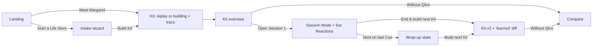

# Memory Lane: UX and design specification

> **Source of truth:** `PLAN.md` overrides this file on conflict (routes: PLAN §3.6; golden path: PLAN §8.2; stream parts: PLAN §4.2; error paths: PLAN §6).

**Status:** v3, 2026-10-03, aligned with PLAN v3. **Owner:** ux-designer.

- **Terms** follow `CONTEXT.md`.
- **Requirement IDs** (FR/NFR/SC) refer to `REQUIREMENTS.md`.
- There is **no app code** here; token blocks are ready to paste.

## Direction: "The Family Album"

A warm editorial scrapbook:
- Each Cue is a mounted photograph.
- Each Session is an album page.
- The Kit is the album.

The two kinds of surface are treated differently:
- **Browsing surfaces are tactile:** paper grain, photo corners, tape, and polaroid mats rotated 1-5 degrees.
- **Session Mode is calm and flat:** no rotation, no grain, maximum contrast.

The agent trace is a "field notebook" ledger. The data viz uses the same paper, tag and stamp vocabulary as the rest of the album.

**Quality bar: 9 of the required 4 qualities.**
1. Scale contrast.
2. Spacing rhythm.
3. Depth.
4. The Fraunces + Atkinson type pairing.
5. Semantic colour with icons.
6. Designed interaction states.
7. Bento album spread.
8. Grain.
9. Motion that explains flow (candidate photos sorted into pages).

---

## 1. Information architecture and routes (PLAN §3.6)

```
/                                   Landing (Meet Margaret | Start a Life Story)
/intake?step=1..6                   Life Story wizard, 6 steps, draft saved locally after every step
/p/[storyId]/kit                    Kit: building (trace + photo pile) -> overview -> diff -> Session list. Print = @media print here
/p/[storyId]/session/[n]?cue=<i>    Session Mode with live Reactions; wrap-up is a state at ?cue=done
/p/[storyId]/compare                "Without Qloo": Baseline Kit vs Kit. Visitor tab (stretch, FR-23)
/about                              How it works, evidence honesty, Qloo, limits; #privacy = Your data (export, import, delete all, Life Story switcher)
```

- **Meet Margaret** is a plain link to `/p/demo-margaret/kit`. That page seeds the demo story if it is missing. There is no `/demo`, `/print` or reactions route.
- **Chrome:**
  - Top bar: wordmark, Life Story switcher (FR-8), "Without Qloo", "Your data".
  - Footer: the not-medical-advice line.
  - Session Mode has no chrome apart from its own controls.
- **URL as state:** `storyId`, `n`, `cue`, `view=diff|trace`, and the compare tab.
- **Stories are local to the device.** A non-demo story URL opened on another device shows: "This Life Story lives on another device. Import it from a file."



## 2. Judge golden path (PLAN §8.2; SC-5 = ≤ 7, met at click 6)

| Click | t | Screen | What the judge sees | Notes |
|---|---|---|---|---|
| 1 **Meet Margaret** | 0:00 | Landing → Kit | Headline, three polaroids, one primary button | The LCP element is the headline |
| — | 0:01-0:03 | Kit (replay) | Banner reads **"Replay of a real run recorded <date> · Build it live"**. The compressed trace (≤ 2.5 s) plays out: six server "Asking Qloo" lines at once, then two Claude lines ("Looking deeper into 'country & western' for Session 2"). Photos fall onto the pile and sort onto pages, ending with "Checked: 21 of 21 Cues came from Qloo." | Kit appears in < 3 s. **Build it live** runs the real path at real pace (about 20 s) |
| — | 0:05 | Kit overview | **Wow frame:** fingerprint and timeline on the left page, 4 Sessions on the right. The trace collapses to "How this was made (13 Qloo calls)" | Focus moves to the `h1`; the status region says "Kit ready" |
| (optional) | 0:15 | Cue card | **Why this?** shows the gauge, Seed bar and stamps (plus a theme stamp if the Cue came from looking deeper) | — |
| 2 **Open Session 1** | 0:25 | Session Mode | Calm full-screen Cue 1 | — |
| 3 **Engaged** | 0:30 | Session Mode | The Reaction is logged. The End button in the **bottom bar** now reads **End & build next Kit** | No auto-advance |
| 4 **Next** | 0:33 | Session Mode | Cue 2 | — |
| 5 **Engaged** | 0:36 | Session Mode | Logged | — |
| 6 **End & build next Kit** | 0:40-1:05 | Kit v2 | No confirm. The trace reads "Using 2 Learned Favorites as new Seeds", the **Learned from last session** diff appears, and Cues cite "Because Margaret was Engaged by …" | Built live. If live fails, the recorded Kit 2 is re-validated; Cues not backed by a current Learned Favorite read "recorded example" |
| 7 **Without Qloo** | 1:15 | Compare | Side-by-side view. Flags: "Not found in Qloo", "Outside 1956-1976", "On Avoid List" | Stamp: "Comparison only. This Kit can't be run." |

**SC-5: ≤ 7, met at click 6.** The improved Kit appears at click 6, and click 7 completes the judge story. Distressed handling is shown outside the golden path.

## 3. Life Story wizard (6 steps)

The wizard shows one idea per screen.
- **Draft:** a single local draft (`StoreV1.draft`) is saved after every step.
- **Progress:** a header reading "Step 2 of 6", drawn as a stitched thread.
- **Navigation:** every step has **Back**; optional steps also have **Skip**.
- **Privacy note:** "Stays on this device. We never send {name} to anyone."

| Step | Collects | Details |
|---|---|---|
| 1 About them | First name, birth year | Window preview: "Reminiscence Window: 1956 to 1976…". "First name only. No surnames or addresses." Inline PII warning |
| 2 Places | Hometown, Young-Adult City (optional), Care Location (optional) | Labels: "Where they grew up", "Where they lived as a young adult", "Where they live now (for outings)" |
| 3 Roots | Heritage, language, occupation | Optional. Helper: "We replace their name with a placeholder before anything leaves this device." |
| 4 Seeds | 2-5 favorites | Each resolves via Qloo. One confident match gets a confirm polaroid; an ambiguous one gets `needs_input` chips. Unresolved text is never accepted |
| 5 Avoid List | Things that might upset | Entities resolve like Seeds. Topics show their outcome ("Matched to a Qloo tag: War films", or "We'll keep this out of conversation Prompts"). An off-by-default toggle reads **"Include themes like war, loss or hospitals"** ("Some veterans enjoy these. Leave off if unsure.") |
| 6 Stage and review | Dementia Stage, summary | Early / Middle / Late radio cards ("Not sure? Choose Middle."), Edit links, **Build Margaret's Kit** |

**Disambiguation and errors:**
- **Disambiguation:** "Which Doris Day did you mean?" is a radiogroup of 2-5 mini-polaroid chips, with a "None of these" option. It never auto-picks.
- **No result:** "We couldn't find 'Pattsy Klein'. Check the spelling or try the full name."
- **Qloo down:** "We can't reach Qloo right now. Your answers are saved." with a Retry button.

## 4. Screen specs

- **Breakpoints:** 320, 375, 768, 1024, 1440, 1920.
- **Container:** fluid `--gutter`, max 80rem (96rem at 1920).
- **Responsive approach:** mobile-first, with `min-width` breakpoints at 48, 64 and 90rem.
- **No horizontal scroll:** rotations sit on inner elements, and `overflow-x: clip` is set on the wrapper.

### 4.1 Landing

```
>=1024                                                        375 / 320
+-----------------------------------------------------+      +--------------+
| Memory Lane                    Without Qloo  Your data|      | Memory Lane  |
|  Songs, films and places      [polaroid A -4deg]    |      | Songs, films |
|  that feel like THEIR         [polaroid B +2deg ]   |      | and places...|
|  youth.        (Fraunces      [polaroid C +5deg ]   |      | [A][B][C]    |
|  A week of Sessions, built    "Margaret, b. 1946,   |      | [Meet Margaret]
|  from what people of her era   Memphis" caption     |      | Start a Life |
|  [Meet Margaret]  Start a Life Story (link)         |      | Story (link) |
|-----------------------------------------------------|      | 1 2 3 steps  |
| 1 Tell us   2 Watch it work   3 Run it, then it learns|    +--------------+
| Without Qloo peek: struck-through generic list | Qloo|
+-----------------------------------------------------+
```

- **Grid:** an asymmetric 7/5 split at 1024+.
- **Images:** `img` with explicit dimensions, allow-listed hosts, and a monogram fallback.

### 4.2 Kit building with trace panel

```
>=1024 (trace rail 24rem, sticky)              <1024
+---------------------------+----------------+  +-----------------------+
| Building Margaret's Kit   | BEHIND THE SCENES |  | Building Margaret's Kit
| Step 3 of 4: Arranging    | Qloo calls 9 . cached 2 | [photo pile]    |
|  PHOTO PILE (data-candidates) | 1 Understanding (server) | == bottom bar ==|
|  [ ][ ][ ][ ][ ][ ]       | 2 Asking Qloo x6 (server) | v Behind the  |
|  + 'looking deeper' batch | 3 Arranging (Claude)    | scenes (9) [Open]|
|  sorted into Session pages| 4 Checking (validator)  +-----------------+
+---------------------------+----------------+
```

- **Photo pile:** fed by `data-candidates`, which carry Qloo names and images only. Candidates from the agent's `expand_theme` calls arrive as a second, labelled batch ("Looking deeper").
- **States:**
  - **streaming**
  - **replay** ("Replay of a real run recorded <date> · Build it live"; "fixture run" before the Qloo key)
  - **partial** ("Books unavailable, Kit built without them")
  - **degraded** ("Cached result. Qloo is busy.")
  - **simple Kit** ("Simple Kit (AI composer unavailable)")
  - **error with a saved Kit** (Cached result badge)
  - **first-run error** ("We couldn't build the Kit this time. Nothing was lost. [Try again] [Meet Margaret]")
  - **success** (panel collapses; focus moves to the `h1`)
- **Stop building:** always available.

### 4.3 Kit overview (the album spread)

```
>=1440 (bento, 12 col)
+---------------------------------------------------------------------+
| [Learned from last session ledger, v2 only: + 2 Learned Fav  - 1 Cue  - 2 Exclusions] |
+------------------------+--------------------------------------------+
| LEFT PAGE (cols 1-4)   | RIGHT PAGE (cols 5-12)                     |
| Margaret, b. 1946      | +---------------------------+ +----------+ |
| Memphis . Middle stage | | SESSION 1 (span 5 col)    | | Session 2| |
| Reminiscence timeline  | | Saturday Night at the     | | Mama's   | |
|  1946---[1956====1976] | | Pictures, 1962 . 35 min   | | Kitchen  | |
| What her taste is made | | 3 polaroids fanned        | +----------+ |
| of (tag ribbon bars)   | | [Open Session 1]          | | Session 3| |
| Avoid List: 2 (view)   | +---------------------------+ +----------+ |
| Actions: Print . Without Qloo . Trace                                |
+------------------------+--------------------------------------------+
768: left page becomes a band above, Sessions in 2 cols.  <=480: single column.
```

- **Session page:** title, theme, format tag, duration, domain icons, a Cue strip, **Open Session N** (filled), and **See all Cues** (`<details>`).
- **Empty domain:** "No books turned up for 1956 to 1976. [Widen by 3 years] [Add a Seed]".
  - Widening is **Caregiver-only**, once per film/TV/book domain.
  - It is never done automatically.
  - Widened Cues are stamped "Just outside 1956-1976".
- **Print:** `@media print` drops the chrome and prints Sessions, Cues, Prompts, tips, the Avoid summary and the safety line.

### 4.4 Cue card and "Why this?"

```
+--------------------------+     Mat = paper, rotation -2 deg; hover/focus straightens and lifts
| [   image 4:3, object-fit cover   ]|
| [type icon] FILM . 1962            |   data-entity-id on the <article>
| Pillow Talk                        |
| "Often loved by people who share   |   whyThis, aggregate phrasing, ≤ 160 chars
|  Margaret's era and favorites."    |
| [Why this?]        [Play on ...]   |
+--------------------------+
```

- **Variants:**
  - domain icon plus label
  - `outsideWindow` stamp ("Just outside 1956-1976")
  - Learned Favorite lineage ("Because Margaret was Engaged by X")
  - **theme stamp**, when the Cue came from the agent's `expand_theme` ("Found by looking deeper into 'country & western'")
  - **"recorded example"** label, on a replayed Kit 2 Cue that has no current Learned Favorite behind it
  - **"fixture data"** footnote, when explainability is synthetic (before the Qloo key)
- **Why this?** opens as an anchored popover at ≥ 768 px and as a bottom sheet below that.

### 4.5 Session Mode (tablet-first; End lives in the bottom bar on every layout)

```
Tablet landscape 1024x768                                      Phone portrait 375
+---------------------------------------------------------+   +----------------+
| Cue 2 of 6 . . o . . .                       [Pause] [A+]|   | 2/6     Pause A+|
|---------------------------------------------------------|   |                |
|   [  large photo, flat,      |  FILM . 1962             |   |  [  image  ]   |
|      no rotation, mat only ] |  Pillow Talk (Fraunces 56)|  |  Pillow Talk   |
|                              |  "Tell me about the      |   |  Prompt (28px) |
|                              |   dances you went to."   |   |  [v For you]   |
|                              |  [Play Doris Day on ...] |   |----------------|
|                              |  v For you (tips, 20px)  |   | Engaged Neutral|
|---------------------------------------------------------|   | Distressed     |
| [Back] [Skip] (Engaged)(Neutral)(Distressed) [Next] [End]|   | [Skip][Next][End]
+---------------------------------------------------------+   +----------------+
```

**Surface and sizing:**
- The surface uses `data-surface="session"` (AAA contrast).
- Body text ≥ 24 px; Prompts 28-30 px.
- No grain or rotation.
- Bottom-bar controls are 56 px tall; nothing is under 48 px.

**Content per screen:**
- One Cue per screen.
- **Skip** and **End** are always visible in the bottom bar.
- Each item in `sensoryActivities[]` gets its own screen.

**Stage variants:**
- **Early:** up to 3 Prompts.
- **Middle:** 1-2 Prompts.
- **Late:** image-first, ≤ 12 words, at least 2 sensory screens.

**The End button changes with the Reaction count:**
- **0 Reactions:** label **End Session**, with a confirm ("End this Session? [Keep going] [End Session]"), then the wrap-up state.
- **≥ 1 Reaction:** label **End & build next Kit**. It saves the log, applies the Reactions and routes to the Kit (v2). No modal.

**Other controls:**
- **Next on the last Cue:** goes to wrap-up (`?cue=done`).
- **"For you" disclosure:** tips, a Provenance line and the safety line.
- **Pause:** shows a calming Learned Favorite.
- **Offline:** a "Working offline" tag appears.

### 4.6 Reaction logging (live; wrap-up is a state)

```
 ( smile-check ) Engaged   ( dash-face ) Neutral   ( soft-frown ) Distressed
```

- **Options:** each has an SVG glyph, a label, a 2 px border, a check when selected, and `aria-checked`.
- **Distressed:** shows a persistent banner: "That's okay. Let's pause. [Switch to something calming] [Skip this one] [End Session] [Undo]". It also says "We'll leave this out from now on." Undo is available until the next Kit.
- **Wrap-up (`?cue=done`):**
  - "How did it go?" with a list of radiogroups ("Not logged" when empty) and a live summary.
  - Actions: **Build next Kit** and **Done for today**.
  - Explanation: "Engaged Cues become Learned Favorites. Distressed Cues are left out next time."
- **Storage-full error:** "We couldn't save on this device. Export your data to keep it. [Export]".

### 4.7 Compare (`/p/[storyId]/compare`)

```
+--------------------------------------------+   <1024: [ With Qloo | Without Qloo ] tabs
| Era match   Qloo 94% ████████  Without 52% ████  |
| Overlap 18% . Not found in Qloo 7 of 24    |
+---------------------+----------------------+
| WITH QLOO (paper)   | WITHOUT QLOO (dim, stamp "Comparison only") |
| Pillow Talk . 1959  | "Doris Day Show" [? Not found in Qloo]       |
|                     | "Gone with the Wind" [cal-x Outside 1956-1976] |
|                     | "Tennessee Waltz" [shield On Avoid List]     |
+---------------------+----------------------+
```

- **Era match** is measured against the original Window, for both columns.
- **Baseline column:** it has no Run, Play or Why this? controls. The note reads "Written by the model alone, with no Qloo data. Shown only for comparison."
- **Demo:** shows a recorded Baseline first, with a "Run it live" option.
- **States:** loading skeleton, a baseline error with Try again, and "Build a Kit first."

### 4.8 Component inventory

The components are:
- Button
- Chip
- Polaroid Cue card
- Album Page
- Photo pile
- Trace line and counter
- Affinity gauge
- Seed bar
- Reminiscence timeline
- Taste tags
- Reaction radiogroup
- Banner (info / notice / error / calm / replay)
- Stepper
- Disambiguation radiogroup
- Popover / sheet
- Diff row

**There are no toasts.** Every interactive component has default, hover, focus-visible, active, disabled, loading and error states.

## 5. Agent trace panel ("Behind the scenes")

**Goal:** show plainly that Qloo is called many times with real signals, that Claude makes visible choices, and that nothing is invented.

**Counters:** `Qloo calls 13 . From cache 3 . Cues found 92 . Chosen 21 . Not from Qloo 0`.

**Phases, each labelled by actor:**
1. Understanding (server)
2. Asking Qloo (server, shown as the group "6 at once")
3. Arranging (Claude)
4. Checking (validator)

**Each line shows:** glyph, sentence, result chip, duration and cache badge, plus a "Technical details" disclosure with redacted params. It never shows raw Life Story text or the first name.

| Event | Human sentence (examples) |
|---|---|
| Server context | "Reading Margaret's Life Story: born 1946, Memphis. Her Reminiscence Window is 1956 to 1976." |
| Prefetch fingerprint | "Working out what Margaret's taste is made of from her 3 Seeds" → "20 tags" |
| Prefetch domain | "Asking Qloo for films, 1956-1976, loved by people 55 and over → 15 Cues" |
| Ladder (no widening) | "No books matched all her Seeds. Trying again with her top 2." |
| Caregiver widened | "Widening films to 1953-1979 as you asked. Cues outside 1956-1976 are marked." |
| Budget | "Qloo call budget reached. Brands left out this time." |
| **`expand_theme` (Claude)** | "Looking deeper into 'country & western' for Session 2 → 8 more Cues" |
| `rerank_cues` (Claude) | "Asking Qloo to re-score 18 shortlisted Cues → top 12 kept" |
| `compose_kit` (Claude) | "Arranging 21 Cues into 4 Sessions, writing Prompts and tips" |
| Validator | "Checked: 21 of 21 Cues came from Qloo. Replaced 2 Prompts. Left out 2 on the Avoid List." |
| Fallback | "Building a simple Kit from the same Qloo Cues" |
| Reaction regeneration | "Using 2 Learned Favorites as new Seeds" / "Leaving out Tennessee Waltz and its 2 top tags" |

**Placement:** a 24rem rail at ≥ 1024 px; below that, a bottom bar with a sheet. After the build it collapses to "How this was made (13 Qloo calls)".

## 6. Provenance visualization

Every mark is built in SVG or CSS from tokens. Every value has text, and colour never carries meaning on its own.

1. **Affinity gauge:** a `<meter>` with a word band. "It describes groups, not Margaret."
2. **Seed contribution bar:** share of `explainability` per Seed, with direct labels and hatching. "Signals only" when there are no Seeds.
3. **Signal stamps:** "Age 55+", "Memphis", "1956-1976". The theme stamp shows when a Cue came from `expand_theme`. Signals that don't apply are dashed, with a reason.
4. **Learned lineage:** "Because Margaret was Engaged by Patsy Cline on 3 Oct". This becomes "recorded example" when no current Learned Favorite backs it.
5. **Reminiscence timeline:** the original Window band with year dots. Widened Cues sit just outside the band, stamped.
6. **Taste fingerprint:** ranked luggage-tag rows, plus a table view.
7. **Compare stat bars:** paired bars with direct labels.

**Copy stays aggregate:** "People who share Margaret's era and favorites often loved this."

## 7. Design tokens (paste into `src/styles/tokens.css`)

- **Fonts:** Fraunces variable (display) and Atkinson Hyperlegible Next (body, falling back to Atkinson Hyperlegible). Both are self-hosted with `next/font/local`, using the Latin subset and `swap`.
- **Contrast:** the CI contrast script (`pnpm a11y:contrast`) is the source of truth.

```css
:root {
  color-scheme: light dark;
  --font-display: "Fraunces", "Iowan Old Style", Georgia, serif;
  --font-body: "Atkinson Hyperlegible Next", "Atkinson Hyperlegible", system-ui, sans-serif;
  --text-xs: clamp(0.8125rem, 0.78rem + 0.1vw, 0.875rem);
  --text-sm: clamp(0.9375rem, 0.9rem + 0.15vw, 1rem);
  --text-base: clamp(1.0625rem, 1rem + 0.3vw, 1.1875rem);
  --text-lg: clamp(1.25rem, 1.1rem + 0.6vw, 1.5rem);
  --text-xl: clamp(1.5rem, 1.2rem + 1.2vw, 2.125rem);
  --text-2xl: clamp(2rem, 1.4rem + 2.4vw, 3.25rem);
  --text-hero: clamp(2.75rem, 1.5rem + 6vw, 6.5rem);
  --text-session-body: clamp(1.5rem, 1.2rem + 1vw, 1.875rem);
  --text-session-title: clamp(2.25rem, 1.4rem + 3.5vw, 4rem);
  --lh-tight: 1.05; --lh-snug: 1.25; --lh-body: 1.55; --lh-session: 1.5;
  --measure: 62ch; --measure-session: 40ch;
  --space-1: 0.25rem; --space-2: 0.5rem; --space-3: 0.75rem; --space-4: 1rem;
  --space-5: 1.5rem; --space-6: 2.5rem; --space-7: 4rem; --space-8: 6.5rem;
  --gutter: clamp(1rem, 0.5rem + 2.5vw, 2.5rem);
  --space-section: clamp(3rem, 2rem + 5vw, 7rem);
  --tap-min: 2.75rem; --tap-session: 3rem; --tap-primary: 3.5rem;
  --radius-photo: 2px; --radius-page: 6px; --radius-control: 14px; --radius-pill: 999px; --radius-sheet: 28px;
  --dur-fast: 120ms; --dur-normal: 240ms; --dur-slow: 480ms; --dur-settle: 700ms;
  --ease-out: cubic-bezier(0.16, 1, 0.3, 1);
  --ease-settle: cubic-bezier(0.2, 0.9, 0.25, 1.04);
  --ease-in-out: cubic-bezier(0.65, 0, 0.35, 1);
  --tilt-a: -3deg; --tilt-b: 2deg; --tilt-c: 4.5deg;
  --grain: url("data:image/svg+xml;utf8,<svg xmlns='http://www.w3.org/2000/svg' width='180' height='180'><filter id='n'><feTurbulence type='fractalNoise' baseFrequency='.85' numOctaves='2' stitchTiles='stitch'/><feColorMatrix values='0 0 0 0 .35  0 0 0 0 .28  0 0 0 0 .2  0 0 0 .55 0'/></filter><rect width='100%' height='100%' filter='url(%23n)'/></svg>");
  --grain-opacity: 0.07;
}
:root, [data-theme="light"] {
  --paper-50:  oklch(98% 0.012 85); --paper-100: oklch(96% 0.020 85); --paper-200: oklch(92% 0.030 82);
  --mat: oklch(97% 0.016 88); --mat-ink: oklch(24% 0.030 55);
  --ink-900: oklch(24% 0.030 55); --ink-700: oklch(38% 0.030 55); --ink-500: oklch(50% 0.030 55);
  --rule: oklch(80% 0.030 75);
  --green-700: oklch(40% 0.070 160); --green-800: oklch(33% 0.065 160);
  --clay-600: oklch(52% 0.140 40); --blue-700: oklch(42% 0.100 250);
  --tape: oklch(86% 0.110 92 / 0.8);
  --focus: oklch(42% 0.160 255); --focus-halo: oklch(98% 0.012 85);
  --engaged-bg: oklch(93% 0.060 150); --engaged-fg: oklch(32% 0.090 150); --engaged-bd: oklch(45% 0.100 150);
  --neutral-bg: oklch(93% 0.015 250); --neutral-fg: oklch(36% 0.035 250); --neutral-bd: oklch(48% 0.040 250);
  --distressed-bg: oklch(93% 0.040 350); --distressed-fg: oklch(38% 0.120 350); --distressed-bd: oklch(48% 0.130 350);
  --notice-bg: oklch(94% 0.070 85); --notice-fg: oklch(36% 0.080 70); --notice-bd: oklch(55% 0.100 75);
  --error-bg: oklch(94% 0.040 25); --error-fg: oklch(38% 0.150 27); --error-bd: oklch(50% 0.160 27);
  --shadow-photo: 0 1px 1px oklch(30% 0.03 55 / .18), 0 6px 14px -6px oklch(30% 0.03 55 / .28), 0 18px 32px -18px oklch(30% 0.03 55 / .30);
  --shadow-lift:  0 2px 2px oklch(30% 0.03 55 / .18), 0 14px 24px -8px oklch(30% 0.03 55 / .32), 0 30px 48px -24px oklch(30% 0.03 55 / .34);
  --shadow-sheet: 0 -12px 40px -12px oklch(30% 0.03 55 / .35);
  --grain-blend: multiply;
}
[data-theme="dark"] {
  --paper-50: oklch(19% 0.015 60); --paper-100: oklch(24% 0.020 60); --paper-200: oklch(29% 0.022 60);
  --ink-900: oklch(94% 0.015 85); --ink-700: oklch(82% 0.020 80); --ink-500: oklch(70% 0.020 75);
  --rule: oklch(38% 0.025 60);
  --green-700: oklch(78% 0.100 160); --green-800: oklch(84% 0.095 160);
  --clay-600: oklch(74% 0.130 45); --blue-700: oklch(80% 0.090 250);
  --tape: oklch(80% 0.090 92 / 0.55);
  --focus: oklch(82% 0.130 85); --focus-halo: oklch(19% 0.015 60);
  --engaged-bg: oklch(30% 0.060 150); --engaged-fg: oklch(90% 0.080 150); --engaged-bd: oklch(72% 0.110 150);
  --neutral-bg: oklch(30% 0.020 250); --neutral-fg: oklch(88% 0.030 250); --neutral-bd: oklch(70% 0.040 250);
  --distressed-bg: oklch(30% 0.050 350); --distressed-fg: oklch(90% 0.070 350); --distressed-bd: oklch(72% 0.120 350);
  --notice-bg: oklch(30% 0.050 85); --notice-fg: oklch(90% 0.080 85); --notice-bd: oklch(72% 0.100 85);
  --error-bg: oklch(30% 0.060 25); --error-fg: oklch(90% 0.070 25); --error-bd: oklch(72% 0.140 27);
  --shadow-photo: 0 1px 0 oklch(100% 0 0 / .05) inset, 0 8px 18px -6px oklch(5% 0 0 / .6), 0 24px 40px -20px oklch(5% 0 0 / .7);
  --shadow-lift:  0 1px 0 oklch(100% 0 0 / .06) inset, 0 16px 28px -8px oklch(5% 0 0 / .65), 0 36px 56px -24px oklch(5% 0 0 / .75);
  --shadow-sheet: 0 -12px 40px -8px oklch(5% 0 0 / .7);
  --grain-blend: soft-light; --grain-opacity: 0.05;
}
@media (prefers-color-scheme: dark) { :root:not([data-theme="light"]) { /* mirror the dark block */ } }
[data-surface="session"] {
  --grain-opacity: 0; --tilt-a: 0deg; --tilt-b: 0deg; --tilt-c: 0deg;
  --bg: oklch(98.5% 0.008 85); --fg: oklch(20% 0.020 55); --fg-2: oklch(34% 0.030 55);
  --btn-bg: oklch(24% 0.030 55); --btn-fg: oklch(98.5% 0.008 85);
}
[data-theme="dark"] [data-surface="session"] {
  --bg: oklch(16% 0.012 60); --fg: oklch(95% 0.010 85); --fg-2: oklch(84% 0.015 85);
  --btn-bg: oklch(94% 0.015 85); --btn-fg: oklch(18% 0.015 60);
}
@media (prefers-reduced-motion: reduce) {
  :root { --dur-fast: 0.01ms; --dur-normal: 0.01ms; --dur-slow: 0.01ms; --dur-settle: 0.01ms; }
}
@media (prefers-contrast: more) { :root { --rule: var(--ink-700); } }
@media (forced-colors: active) { /* keep borders on chips, gauges, radios */ }
body { background-color: var(--paper-50); background-image: var(--grain); background-blend-mode: var(--grain-blend); }
```

- **Grain:** a body background, painted once.
- **Elevation:** 0 flat → photo → lift → sheet.
- **Motion:** settle, FLIP sort, trace enter, sheet open, and gauge draw. All use transform and opacity only.

## 8. Copy guidelines

**Voice:** warm, plain and short.
- Speak to the Caregiver as "you".
- Use the Person's first name.
- Aim for grade 6 in Session Mode.
- Put dignity first.
- No exclamation marks.

| Use | Never |
|---|---|
| Person, Margaret | patient, sufferer, resident |
| Caregiver ("you") | user, staff, admin |
| Cue, Session, Kit, Prompt, Reaction, Seed, Avoid List, Life Story, Exclusion, Learned Favorite | recommendation, activity, plan, rating, blacklist, trigger, profile |
| "Reminiscence activities" | "therapy", "treatment", "improves memory", "slows decline" |
| "Tell me about the dances you went to" | "Do you remember...?", "What year...?", "Who was...?" |
| Engaged / Neutral / Distressed | liked / meh / hated, stars |

**Example Session titles and themes** (these must pass `checkText` untouched):
- "Saturday Night at the Pictures, 1962"
- "Mama's Kitchen"
- "Sunday Best at the Grand Ole Opry"
- "Christmas on Beale Street"

**Not medical advice:**
- **Full** (Kit, "For you", print, End confirm): "Memory Lane suggests activities. It is not medical advice or therapy. Stop if Margaret seems upset, and talk to their care team about changes in mood or health."
- **Short** (footer): "Suggestions only, not medical advice."

**Key strings:**
- **Replay:** "Replay of a real run recorded <date> · Build it live".
- **Recorded example:** "Recorded example (not from today's Reactions)".
- **Fixture data:** "Fixture data: scores are illustrative until live Qloo data arrives".
- **Cached:** "Cached result. Qloo is busy, so this is from 3 Oct."
- **Simple Kit:** "Simple Kit (AI composer unavailable). Every Cue still comes from Qloo."
- **Privacy:** "Life Stories stay in this browser. There are no accounts. We don't send {name} to Qloo or the AI."
- **Delete all:** "Delete all data? This removes every Life Story and Session Log from this device. Export first if you want a copy. [Export] [Delete everything]"
- **Errors** say what happened, that data is safe, and what to do next. They never show raw codes.

## 9. Accessibility spec (WCAG 2.2 AA app-wide, AAA in Session Mode)

**Structure:**
- Landmarks.
- A skip link first.
- One `h1` per route; focus moves to it on route change.

**Keyboard:**
- **Wizard:** chips form a radiogroup; the error summary takes focus.
- **Kit:** Esc closes Why this? and returns focus.
- **Session Mode:**
  - Focus starts on the Cue title.
  - Tab order: Pause, text size, For you, Play, then the **bottom bar: Back, Skip, Reactions, Next, End**.
  - Optional shortcuts work only inside the player and can be turned off.
- **Compare:** ARIA tabs.

**Streaming trace:**
- The ledger is `aria-live="off"`.
- A hidden, polite, atomic `role="status"` announces only phase changes and results, at most one every 4 s (for example "Step 3 of 4: Claude is arranging Sessions", "Kit ready").
- Errors use `role="alert"` once.
- The ledger is an `ol`, the toggle has `aria-expanded`, and the counters use a `dl`.

**Contrast:**
- Ink on paper: 15:1.
- Buttons: 8:1.
- Semantic foreground on background: 7:1.
- Borders: 3:1.
- Session Mode: 7:1 body, 4.5:1 large text.

**Never colour alone:** glyphs, labels, patterns and words always back up colour.

**Targets and text:**
- Targets: 44 px app-wide, 48 px in Session Mode, 56 px primary.
- Reaction options: ≥ 96 × 56.
- Body text: ≥ 17 px, or ≥ 24 px in Session Mode.
- Pages reflow at 320 px.

**Motion:** reduced motion leaves only fades of ≤ 120 ms. Nothing auto-advances.

**Verification:**
- axe passes.
- Golden path runs keyboard-only and with reduced motion.
- VoiceOver on iPad Safari.
- Playwright on chromium phone and tablet, webkit iPad and firefox desktop.
- No overflow at 320-1920.

## 10. Three Session Mode directions (`?variant=a|b|c`, picked at check-in (b))

All three keep AAA contrast, 48 px targets, and Skip, Pause and End in the bottom bar.

- **A. "Turn the Page" (scrapbook spread).**
  - Layout: photo left, text right; a page-turn advance.
  - Reactions: stamp buttons.
  - Best for: two people sharing one tablet.
- **B. "The Window" (photo-first).**
  - Layout: edge-to-edge image, large captions.
  - Reactions: in a rail above the bottom bar.
  - Best for: late stage.
- **C. "Run of Show" (Caregiver console).**
  - Layout: a running order plus a "Show to the Person" view.
  - Prompts: a checklist.
  - Best for: coordinators and therapists.

---

## Open design risks
1. **Replay perception.** It is labelled, and "Build it live" is one click away.
2. **Imagery** depends on Qloo and the allow-list. The monogram fallback must look intentional.
3. **Estimated contrast.** The script must confirm it before slice 4.
4. **Atkinson Hyperlegible Next** family name to verify at build.
5. **Mistaken Distressed taps.** Persistent Undo; validated in the prototypes.
6. **No bundled third-party artwork.**

## Decision: Session Mode direction (check-in (b), 2026-10-03)

The user picked **Variant C, "Run of Show"**, as the production Session Mode. Its pieces:
- A Caregiver console with a running-order list of steps, each with a Reaction chip.
- Prompts presented as a checklist.
- Reactions in their own row on the bottom bar.
- A "Show to the Person" toggle that opens a large, clean view.
- A Distressed Reaction returns automatically to the console.

The reference implementation is `src/app/prototype/session-mode/VariantC.tsx`. Treat it as a reference only, and delete the prototype route once ticket 17 ships. Variants A and B are discarded.
